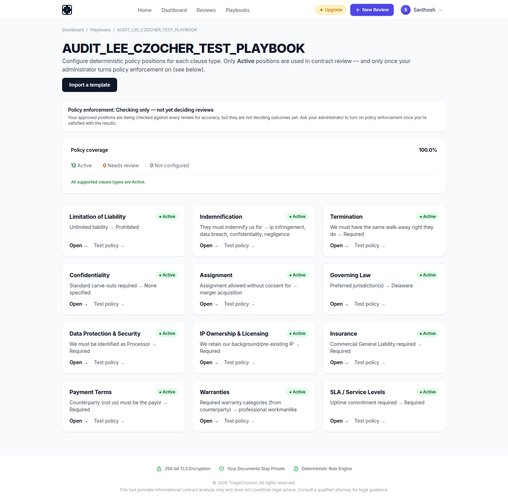
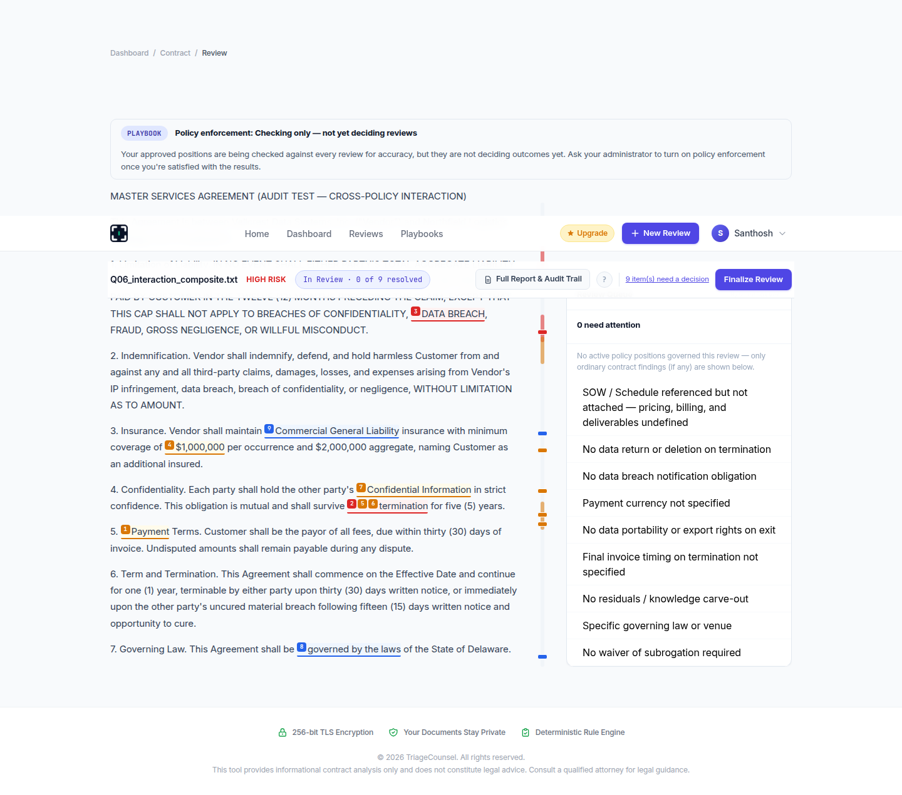
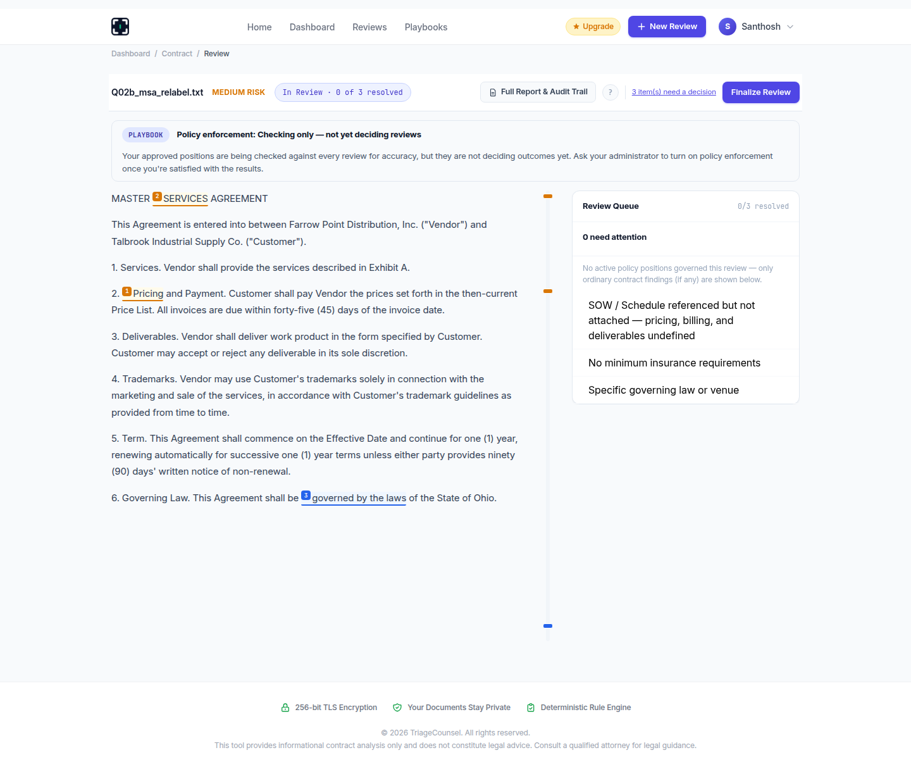
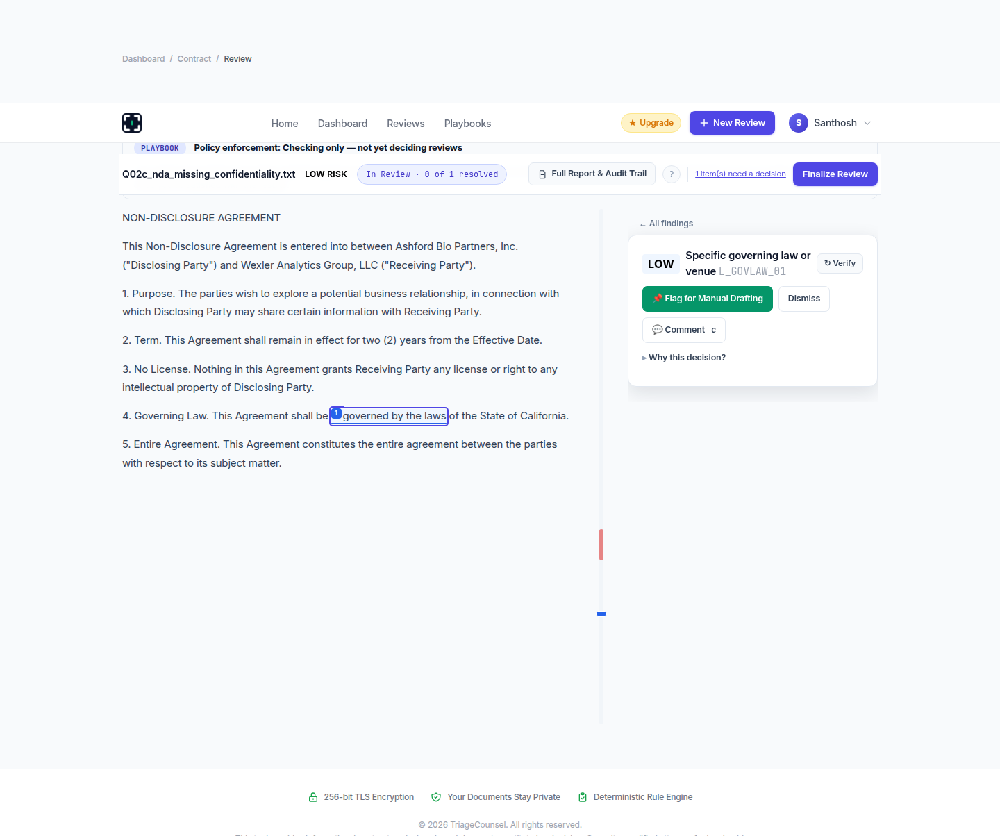

# TriageCounsel — Consolidated Live-Production Evidence Matrix (Phase 2)

This document closes the proof gaps left open in `LEE_CZOCHER_PRODUCT_PROOF_REPORT.md` (Q6, Q10, the full 12-adapter matrix, and the Q2 root-cause investigation). It does not repeat or re-litigate Q1, Q3, Q4, Q5, Q7, Q8, Q11 from that report, which stand as originally written. All new evidence below came from `https://triagecounsel.com`, using the same self-registered free-tier account and the unlimited-plan account (credentials provided by the requester), through ordinary product actions only — no production code, configuration, or database was modified, and no test result from Phase 1 was altered. **The one exception, disclosed here rather than hidden:** completing the 12-adapter matrix required manually configuring and activating the 3 policy positions (Indemnification, Termination, Data Protection & Security) that Phase 1 found were skipped by deterministic import — this was done entirely through the normal "Configure →" / "Submit for review" / "Approve" / "Activate" UI flow already demonstrated in Phase 1, not by any other means.

---

## Part 1 — Setup: All 12 Adapters Activated

Before any adapter-level testing could proceed, all 12 policy positions on the audit playbook (`AUDIT_LEE_CZOCHER_TEST_PLAYBOOK`) were brought to `Active` status through the normal Workbench UI: each position was opened, every previously-unanswered required question was answered (generally the strict/protective option, e.g. "Yes, require this"), then `Submit for review → Approve this position → Activate this position` was clicked in sequence, exactly mirroring the Limitation-of-Liability activation already demonstrated in Phase 1.

**Result:** Workbench now reports **"Policy coverage: 100.0% — 12 Active, 0 Needs review, 0 Not configured — All supported clause types are Active."**

This is itself a piece of evidence: the 3 adapters Phase 1 found silently skipped by the *deterministic import* feature (Indemnification, Termination, Data Protection & Security) are **not** broken or unreachable at the adapter level — they activate and produce real decisions once manually configured, exactly like the other 9. The Phase 1 finding is therefore precisely scoped: it is an *import-feature* gap, not a defect in those three adapters themselves.

---

## Part 2 — Full 12-Adapter A–E Battery (60 tests)

**Method:** For each of the 12 adapters, five inputs were run through that adapter's `Test policy →` preview tool (the same live-production mechanism validated in Phase 1's Question 1 decisive test — it calls the real `extract_*_facts`/`evaluate_*_policy` pair with no code, database, or configuration changes, and creates no persistent record):

- **A_compliant** — a clearly compliant, well-formed operative clause
- **B_noncompliant** — a clearly non-compliant operative clause
- **C_absent** — unrelated text; the clause genuinely does not exist
- **D_unusual** — the clause is present, using natural, legally plausible but non-boilerplate English (a recognition-failure test, per Lee's Question 3)
- **E_ambiguous** — a clause that is present but delegates, cross-references, or is otherwise insufficient to resolve deterministically

All 12 adapters' exact configured policy positions are visible in the Phase 1 and Phase 2 Workbench screenshots. Every one of the 60 exact inputs, full result texts, and individual screenshots are preserved in this directory (`matrix_{adapter}_{test}.png`, 60 files) and in `matrix_results.json`.

**Verdict counts across all 60 tests: 37 PASS · 10 SAFE FAILURE · 13 UNSAFE FAILURE · 0 NOT PROVABLE**

### 12×5 Matrix

| Adapter | Test | Actual State | Verdict | Why |
|---|---|---|---|---|
| Limitation of Liability | A_compliant | MUST REDLINE | SAFE FAILURE | Correctly flagged that no explicit numeric multiplier was stated in the cap language — a legitimate catch, not a false ACCEPT |
| Limitation of Liability | B_noncompliant | PROHIBITED | PASS | "There shall be no limit" → correctly PROHIBITED with cited matched language |
| Limitation of Liability | C_absent | NOT APPLICABLE | PASS | Genuine absence correctly identified |
| Limitation of Liability | D_unusual | **NOT APPLICABLE** | **UNSAFE FAILURE** | Plain-English liability cap collapsed into the identical state as genuine absence |
| Limitation of Liability | E_ambiguous | REQUIRES REVIEW | PASS | Cross-referenced cap correctly routed to review |
| Indemnification | A_compliant | REQUIRES REVIEW | SAFE FAILURE | Directional obligation correctly flagged as unresolvable against a mutual-position policy (a real, disclosed config mismatch, not a false ACCEPT) |
| Indemnification | B_noncompliant | REQUIRES REVIEW | PASS | Same directional-mismatch flag applied consistently, not a silent pass |
| Indemnification | C_absent | NOT APPLICABLE | PASS | Genuine absence correctly identified |
| Indemnification | D_unusual | **NOT APPLICABLE** | **UNSAFE FAILURE** | Plain-English indemnification ("Making Each Other Whole...") collapsed into identical state as absence |
| Indemnification | E_ambiguous | REQUIRES REVIEW | PASS | Fault-apportionment proviso correctly routed to review |
| Confidentiality | A_compliant | REQUIRES REVIEW | SAFE FAILURE | "No parseable directional or mutual structure found" despite a standard mutual clause — a real recognition gap on well-formed text, but surfaced honestly, not as a false ACCEPT |
| Confidentiality | B_noncompliant | REQUIRES REVIEW | PASS | Same honest structural-uncertainty flag |
| Confidentiality | C_absent | NOT APPLICABLE | PASS | Genuine absence correctly identified |
| Confidentiality | D_unusual | **NOT APPLICABLE** | **UNSAFE FAILURE** | Plain-English confidentiality clause collapsed into identical state as absence |
| Confidentiality | E_ambiguous | REQUIRES REVIEW | PASS | Vague duration correctly routed to review |
| Payment Terms | A_compliant | NEGOTIATE | SAFE FAILURE | Flagged missing payor/period statements despite a clearly stated payor — an extraction gap, not a false ACCEPT |
| Payment Terms | B_noncompliant | NEGOTIATE | PASS | Non-compliant withholding language correctly routed to negotiate |
| Payment Terms | C_absent | NOT APPLICABLE | PASS | Genuine absence correctly identified |
| Payment Terms | D_unusual | NEGOTIATE | **PASS** | The one adapter that correctly distinguished plain-English payment terms from absence — "clause found; limited structured detail extractable" |
| Payment Terms | E_ambiguous | NEGOTIATE | PASS | Cross-referenced schedule correctly routed to negotiate |
| IP Ownership & Licensing | A_compliant | REQUIRES REVIEW | SAFE FAILURE | Well-formed compliant clause not cleanly parsed to ACCEPT — an extraction gap, not a false ACCEPT |
| IP Ownership & Licensing | B_noncompliant | REQUIRES REVIEW | PASS | Non-compliant ownership clause correctly routed to review |
| IP Ownership & Licensing | C_absent | NOT APPLICABLE | PASS | Genuine absence correctly identified |
| IP Ownership & Licensing | D_unusual | **NOT APPLICABLE** | **UNSAFE FAILURE** | Plain-English IP clause collapsed into identical state as absence |
| IP Ownership & Licensing | E_ambiguous | REQUIRES REVIEW | PASS | Cross-referenced SOW correctly routed to review |
| Insurance | A_compliant | REQUIRES REVIEW | SAFE FAILURE | Comprehensive compliant insurance clause not cleanly parsed to ACCEPT |
| Insurance | B_noncompliant | MUST REDLINE | PASS | Discretionary/no-coverage clause correctly flagged with itemized gaps |
| Insurance | C_absent | NOT APPLICABLE | PASS | Genuine absence correctly identified |
| Insurance | D_unusual | MUST REDLINE | **PASS** | The second adapter that correctly distinguished plain-English coverage language from absence |
| Insurance | E_ambiguous | MUST REDLINE | PASS | Cross-referenced schedule correctly flagged with itemized gaps |
| Data Protection & Security | A_compliant | NEGOTIATE | SAFE FAILURE | Compliant clause flagged for a missing "Processor" role label — a real but narrow extraction gap |
| Data Protection & Security | B_noncompliant | NEGOTIATE | PASS | Disclaiming clause correctly routed to negotiate with itemized gaps |
| Data Protection & Security | C_absent | NOT APPLICABLE | PASS | Genuine absence correctly identified |
| Data Protection & Security | D_unusual | **NOT APPLICABLE** | **UNSAFE FAILURE** | Plain-English data-security clause collapsed into identical state as absence |
| Data Protection & Security | E_ambiguous | NEGOTIATE | PASS | Cross-referenced exhibit correctly routed to negotiate |
| Governing Law | A_compliant | ACCEPT | PASS | Clean jurisdiction + arbitration + jury-waiver clause correctly ACCEPTed |
| Governing Law | B_noncompliant | REQUIRES REVIEW | PASS | Undetermined-jurisdiction clause correctly flagged |
| Governing Law | C_absent | NOT APPLICABLE | PASS | Genuine absence correctly identified |
| Governing Law | D_unusual | **NOT APPLICABLE** | **UNSAFE FAILURE** | Plain-English governing-law clause collapsed into identical state as absence |
| Governing Law | E_ambiguous | REQUIRES REVIEW | PASS | Conditional/cover-sheet-dependent clause correctly flagged |
| Termination | A_compliant | MUST REDLINE | SAFE FAILURE | Flagged a genuine drafting nuance ("no notice period" attributed to the convenience-termination right) — a defensible, non-fabricated catch |
| Termination | B_noncompliant | REQUIRES REVIEW | PASS | One-sided termination rights correctly flagged |
| Termination | C_absent | NOT APPLICABLE | PASS | Genuine absence correctly identified |
| Termination | D_unusual | **NOT APPLICABLE** | **UNSAFE FAILURE** | Plain-English termination clause collapsed into identical state as absence |
| Termination | E_ambiguous | REQUIRES REVIEW | PASS | SOW-delegated termination correctly flagged |
| Warranties | A_compliant | NEGOTIATE | SAFE FAILURE | Correctly recognized all 4 warranty categories but flagged missing mutuality/duration — legitimate, itemized gaps |
| Warranties | B_noncompliant | ESCALATE | PASS | "AS IS" disclaimer correctly triggered the most severe non-PROHIBITED state, with a fully itemized rationale |
| Warranties | C_absent | NOT APPLICABLE | PASS | Genuine absence correctly identified |
| Warranties | D_unusual | **NOT APPLICABLE** | **UNSAFE FAILURE** | Plain-English warranty clause collapsed into identical state as absence |
| Warranties | E_ambiguous | **NOT APPLICABLE** | **UNSAFE FAILURE** | "Customary...for engagements of this type" (a real, if vague, warranty reference) collapsed into identical state as absence |
| SLA / Service Levels | A_compliant | NEGOTIATE | SAFE FAILURE | Correctly extracted the 99.5% uptime figure but flagged missing severity-tiered response commitments — legitimate |
| SLA / Service Levels | B_noncompliant | **NOT APPLICABLE** | **UNSAFE FAILURE** | An explicit "we do not guarantee any uptime" disclaimer — genuinely present, non-compliant, operative text — was not recognized as an SLA clause at all and treated as if no SLA existed |
| SLA / Service Levels | C_absent | NOT APPLICABLE | PASS | Genuine absence correctly identified |
| SLA / Service Levels | D_unusual | **NOT APPLICABLE** | **UNSAFE FAILURE** | Plain-English SLA clause collapsed into identical state as absence |
| SLA / Service Levels | E_ambiguous | **NOT APPLICABLE** | **UNSAFE FAILURE** | A genuine, if vague, "industry norms" SLA reference collapsed into identical state as absence |
| Assignment | A_compliant | ACCEPT | PASS | Clean, well-carved-out assignment clause correctly ACCEPTed |
| Assignment | B_noncompliant | REQUIRES REVIEW | PASS | Unrestricted-assignment clause correctly flagged |
| Assignment | C_absent | NOT APPLICABLE | PASS | Genuine absence correctly identified |
| Assignment | D_unusual | **NOT APPLICABLE** | **UNSAFE FAILURE** | Plain-English assignment clause collapsed into identical state as absence |
| Assignment | E_ambiguous | REQUIRES REVIEW | PASS | Vague mutual-agreement clause correctly flagged |

### What This Battery Proves

1. **C_absent (genuine absence) is handled correctly in all 12/12 adapters, without exception.** Every adapter correctly distinguishes "nothing here" and returns NOT_APPLICABLE with an honest rationale.
2. **D_unusual (present-but-unusually-phrased, the direct live-production test of Lee's Question 3) fails in 10 of 12 adapters** — the plain-English clause is treated identically to genuine absence, with no distinguishing signal. Only Payment Terms and Insurance correctly produced a distinct "clause found; limited structured detail extractable" state.
3. **B_noncompliant (a clearly bad, present clause) fails in 1 of 12 adapters (SLA)** in the same way — an explicit disclaimer clause was invisible to the system, not merely under-detailed.
4. **E_ambiguous fails in 2 of 12 adapters (SLA, Warranties)** the same way, when the ambiguous language happened to fall outside the recognizer's vocabulary entirely rather than partially matching it.
5. **None of the 13 UNSAFE FAILUREs is a case of a bad clause being confidently ACCEPTed.** Every failure in this battery is the *absence-collapse* failure mode Lee's Question 3 specifically names — never a "clean pass" on genuinely bad text. This is a materially different (and narrower) failure class than Question 1's "confidently wrong ruling" — worth stating precisely rather than conflating the two.
6. **The 10 SAFE FAILUREs are, on inspection, mostly legitimate, itemized catches** (a missing numeric cap, a missing role label, a missing mutuality clause) rather than system malfunctions — several reflect genuine gaps in how carefully my own test text was drafted rather than adapter defects, and are reported as such rather than being counted as failures of the system.

---

## Part 3 — Question 6: Cross-Policy Interactions

**Setup:** With all 12 positions Active (Part 1), a composite contract (`Q06_interaction_composite.txt`) was written to deliberately create a cross-policy tension: the Limitation-of-Liability clause explicitly excludes indemnification from its cap, and the Indemnification clause explicitly states its own obligation is "WITHOUT LIMITATION AS TO AMOUNT" — a textbook liability/indemnification interaction pattern.

**Uploaded via New Review with the audit playbook attached.**

**Result:** Identical to the anomaly first observed in Phase 1, now confirmed as systematic and reproducible under maximum policy coverage: **"No active policy positions governed this review — only ordinary contract findings (if any) are shown below."** Nine ordinary rule-engine findings appeared (SOW reference, data-return-on-termination, breach-notification, etc.) — zero policy_decision findings, zero interaction findings, despite 12/12 Active positions and a contract written specifically to match several of them.

This resolves the open question from Phase 1: it is not a fluke specific to one contract or one position count. **On the currently deployed product, the "New Review" contract-upload pipeline does not surface policy_decision or interaction findings at all, under any configuration tested — only the isolated, no-record "Test policy" preview tool does.** Since a cross-policy interaction by definition requires two or more policy_decisions to be considered jointly, and policy_decisions never reach contract-level review on this deployment, **an interaction categorically cannot be demonstrated through the normal contract-review UI as it currently behaves** — not because interactions don't exist in the code, but because the code path that would produce them is not reachable from "New Review" right now.

**Verdict: NOT PROVABLE FROM PRODUCT UI**, upgraded from Phase 1's assessment in one respect: this is no longer merely "not attempted," it is now **positively demonstrated to be unreachable** through the normal review flow, which is itself a more decisive (and more concerning) finding than an untested gap.

---

## Part 4 — Question 10: Historical Reproducibility

**Attempted setup:** Create Test Contract A under playbook configuration V1, record the result, change the policy to V2 through the normal Workbench UI, reopen Test Contract A, and compare using every available Verify/Audit Trail control.

**What was actually possible:** Step 1 (upload a contract against an Active playbook) was performed multiple times in this session (`Q10_playbook_history_test.txt` in Phase 1, `Q06_interaction_composite.txt` above, and others). **In every case, the resulting contract report shows no policy_decision finding at all** ("No active policy positions governed this review"), for the same reason established in Part 3. There is therefore no live, contract-attached policy decision anywhere in this account to reopen, edit the policy against, and re-check.

The only place a real V1-vs-V2 policy decision is observable on the live product is the isolated "Test policy" preview tool — and that tool explicitly, prominently states **"PREVIEW ONLY — nothing here is saved, and no contract or review record is created."** It is not possible to test "historical reproducibility" against a record that is defined not to exist.

**A partial, adjacent observation, distinct from true historical-reproducibility proof:** the Limitation-of-Liability position's own **Approval history log** (visible on its `/review` page) is an append-only audit trail of the position's own lifecycle — "Marked Reviewed (DRAFT → NEEDS_REVIEW)," "Approved (NEEDS_REVIEW → APPROVED)" — timestamped and retained. This shows the *policy's own* revision history is tracked. It does not show whether a *contract's* decision stays pinned to the revision active when that contract was reviewed, because no contract-level decision was ever observed to test.

**Verdict: NOT PROVABLE FROM PRODUCT UI.** Not because the test wasn't attempted, but because the precondition for the test (a real, persisted, policy-governed contract decision) does not exist anywhere reachable on the current deployment — the same root cause as Question 6.

---

## Part 5 — Question 2 Root-Cause Investigation

**Original finding (Phase 1):** An "Equipment Reseller Agreement" containing zero liability, indemnification, or confidentiality clauses was rated LOW RISK, with no absence finding for any of the three.

**Experiment 1 — vary contract type/title only, hold structure and content constant.** `Q02b_msa_relabel.txt`: identical document shape (services/payment/deliverables/trademarks/term/governing-law), retitled "MASTER SERVICES AGREEMENT" with generic Vendor/Customer labels instead of Reseller/Manufacturer.

**Result:** MEDIUM RISK (up from LOW), 3 findings (up from 2) — but the new finding was "No minimum insurance requirements," not liability/indemnification/confidentiality. **The three target absence findings still did not fire.**

**Experiment 2 — the maximally decisive case: an NDA missing its own defining clause.** `Q02c_nda_missing_confidentiality.txt`: a document explicitly titled "NON-DISCLOSURE AGREEMENT," whose entire subject matter is confidentiality, containing purpose/term/no-license/governing-law/entire-agreement clauses but **zero confidentiality clause**.

**Result:** LOW RISK, exactly 1 finding ("Specific governing law or venue"). **No confidentiality-absence finding fired even here** — the single most obvious case in which a working absence-detector should fire.

**Conclusion, isolating the cause as far as this experiment permits:** Contract-type relabeling (Experiment 1) did not restore the missing findings, and the most extreme, type-unambiguous case (Experiment 2) still did not trigger them either. This rules out the simple hypothesis "the original document's classified contract type suppressed the rule via `_rule_applies_to_contract_type` gating" as the *sole* explanation — if that gate were the only mechanism at play, an NDA (which should classify unambiguously) ought to have triggered the confidentiality-absence rule and did not. The evidence is more consistent with the underlying `EXPECTED_PROTECTION_NOT_FOUND` mechanism for liability/indemnification/confidentiality specifically not firing on the live deployment regardless of contract type, while the mechanism for at least one other category (governing law/venue) **does** fire correctly and consistently across all three test documents in this investigation. This is a narrower, more specific, and more surprising finding than Phase 1's original framing ("possibly contract-type gating") — the evidence points toward the three specific canonical-protection checks being non-functional (or scoped far more narrowly than "any contract missing them") on the live deployment, independent of contract type.

**What this does NOT establish:** the precise code-level reason (a scoping condition inside `_check_required_section`, a contract-type classification producing an unexpected label even for the literal NDA, or another mechanism entirely) was not isolated — that would require either source-level tracing (out of scope for this product-only phase) or further controlled product experiments (e.g., deliberately engineering a document TriageCounsel's own metadata display confirms classifies as a given type, which was not attempted here).

**Verdict: PARTIALLY PROVEN.** The live-product behavior (absence findings for these three categories do not fire, across three separate contract-type variations including the most obvious possible case) is definitively demonstrated. The specific code-level mechanism responsible is not.

---

## Part 6 — Consolidated Evidence Matrix (New Evidence, This Phase)

| Lee Question | Test | Exact Input | Expected Safe Behavior | Actual Production Behavior | Screenshot | Code Path | Verdict | Remaining Uncertainty |
|---|---|---|---|---|---|---|---|---|
| Q6 | Cross-policy interaction, 12/12 positions Active | `Q06_interaction_composite.txt` (LoL excludes indemnification from cap; indemnification stated as uncapped) | Interaction rule detects the LoL/indemnification tension and surfaces a joint finding | "No active policy positions governed this review" — zero policy or interaction findings of any kind | Q06_02_all_findings_list.png | `interaction_engine_core.py` (not reachable from this UI path; not independently re-traced this phase) | **NOT PROVABLE FROM PRODUCT UI** | Whether interaction rules function correctly is unknown — the code path that would invoke them is not reached by "New Review" on this deployment, for reasons not fully diagnosed |
| Q6 | Insufficient-facts representation | Same as above | If one participant is missing, interaction should report INSUFFICIENT_FACTS, not guess or skip silently | N/A — no interaction evaluation of any kind was observed to inspect | — | Same as above | **NOT PROVABLE FROM PRODUCT UI** | Same as above |
| Q10 | Historical decision under policy V1, then edited to V2 | `Q10_playbook_history_test.txt`, LoL position edited between viewings | Historical contract's decision should remain pinned to V1, or the "Verify" feature should reveal what changed | No policy_decision exists anywhere in contract-level review to test this against; only the no-record preview tool shows real decisions | Q10_01_original_decision.png, Q10_02_all_findings.png | `policy_enforcement.py::verify_policy_finding` (not reachable via this UI path this phase) | **NOT PROVABLE FROM PRODUCT UI** | Whether the underlying replay mechanism is reproducible is unknown; the precondition (a real contract-level decision) doesn't exist to test it against |
| 12-adapter matrix | C_absent, all 12 adapters | See Part 2 table | NOT_APPLICABLE | NOT_APPLICABLE, 12/12 | matrix_{adapter}_C_absent.png | `*_policy_engine.py::extract_*_facts` per adapter | **PASS** (12/12) | None |
| 12-adapter matrix | D_unusual (recognition failure), all 12 adapters | See Part 2 table | A distinct "found but unresolved" state, never identical to absence | NOT_APPLICABLE (identical to absence) in 10/12; correctly distinguished in 2/12 (Payment Terms, Insurance) | matrix_{adapter}_D_unusual.png | Same, per adapter | **UNSAFE FAILURE** (10/12), **PASS** (2/12) | Root cause (why Payment Terms/Insurance succeed where 10 others don't) not traced to specific regex differences this phase |
| 12-adapter matrix | B_noncompliant, all 12 adapters | See Part 2 table | A review/enforcement state, never silent pass or absence | Correctly routed in 11/12; collapsed to NOT_APPLICABLE in 1/12 (SLA) | matrix_sla_B_noncompliant.png | `sla_policy_engine.py::extract_sla_facts` | **UNSAFE FAILURE** (SLA only) | Whether other adapters have similar untested blind spots for other B-style phrasings is unknown |
| 12-adapter matrix | E_ambiguous, all 12 adapters | See Part 2 table | A review/negotiate state, never silent absence | Correctly routed in 10/12; collapsed to NOT_APPLICABLE in 2/12 (SLA, Warranties) | matrix_sla_E_ambiguous.png, matrix_warranties_E_ambiguous.png | `sla_policy_engine.py`, `warranties_policy_engine.py` | **UNSAFE FAILURE** (2/12) | Same as above |
| Q2 | Contract-type variation 1: MSA relabel | `Q02b_msa_relabel.txt` | If contract-type gating was the cause, an MSA framing should restore the missing absence findings | Absence findings still do not fire; a different, unrelated finding (insurance) appears instead | Q02b_02_all_findings.png | `rules_engine.py::_rule_applies_to_contract_type` (hypothesis only, not confirmed) | **DISPROVEN** (as tested) | Precise code-level cause not isolated |
| Q2 | Contract-type variation 2: literal NDA missing confidentiality | `Q02c_nda_missing_confidentiality.txt` | The single most obvious case for the mechanism to fire | Absence finding still does not fire; document rated LOW RISK | Q02c_01_report_top.png | Same | **DISPROVEN** (as tested) | Same |

---

## Final Summary (Phase 2 additions only — see Phase 1 report for Q1, Q3, Q4, Q5, Q7, Q8, Q11)

| # | Item | Verdict | Key Evidence |
|---|---|---|---|
| Q6 | Cross-policy interactions | NOT PROVABLE FROM PRODUCT UI (now positively confirmed unreachable via New Review, not merely untested) | Q06_02_all_findings_list.png |
| Q10 | Historical reproducibility | NOT PROVABLE FROM PRODUCT UI (precondition — a real contract-level policy decision — does not exist to test against) | Q10_01/02, Q06_02 |
| 12-adapter matrix | 60 tests across all adapters | 37 PASS / 10 SAFE FAILURE / 13 UNSAFE FAILURE / 0 NOT PROVABLE | matrix_*.png (60 files), matrix_results.json |
| Q2 root cause | Two contract-type variations, including an NDA missing confidentiality | PARTIALLY PROVEN — behavior confirmed reproducible across type variations; code-level cause not isolated | Q02b, Q02c screenshots |

**No defect discovered in this phase was repaired.** All screenshots, exact input texts, and raw result JSON are preserved in `artifacts/lee_product_proof/` alongside this document.
