# TriageCounsel Product Proof Against Lee Czocher's Questions

**Scope note:** All product screenshots in this report were captured from `https://triagecounsel.com` in live browser sessions (Playwright-driven Chromium, TLS forced to 1.2 to work around a local sandbox proxy incompatibility — a client-side network fix, not a change to TriageCounsel). Two accounts were used: a freshly self-registered free-tier account ("Lee Czocher Audit (Claude Test)") and a pre-existing unlimited-plan account the requester provided credentials for ("Santhosh"), which already contained 27 pre-existing real contracts I did not touch, view in detail, delete, or reference as evidence. All test contracts I uploaded are clearly named with a `Q0#_`/`Q10_` prefix and are fictional (fictional party names, generic clause language written for this audit). No production code was modified. No internal endpoints or database access were used to produce any PRODUCT PROOF claim — every product observation below came from clicking through the UI a normal user would use.

## Executive Result

TriageCounsel's self-serve product surfaces two materially different systems, and this distinction turned out to be the single most important fact this audit uncovered:

1. **The free/no-playbook tier** runs only the deterministic pattern-matching rule engine (~185 rules) plus an LLM narration layer. This is what any visitor gets from "Start Free Review" with no playbook attached.
2. **The policy-engine layer** (ACCEPT/NEGOTIATE/ESCALATE/PROHIBITED/REQUIRES_REVIEW decisions, the layer most of Lee Czocher's questions are actually about) is gated behind playbooks, which are gated behind "Early Access" (a sales conversation, not a self-serve checkout) for a brand-new account. It is reachable on an existing unlimited-plan account, where I built a dedicated audit playbook and exercised it directly.

**The most important finding of this audit is a fully reproducible, live-production confirmation of Lee's core Question 1 concern.** A sentence I wrote that explicitly, textually identifies itself as generic industry background ("This Agreement reflects industry practices commonly observed... As is standard in the industry, Vendor shall indemnify Customer...") was cited by the real production Indemnification policy engine as the "MATCHED LANGUAGE" supporting a clean **NEGOTIATE** decision — a non-escalated, "everything is fine, just negotiate this term" outcome — with zero confidence or uncertainty signal anywhere in the result. See Question 1 below for the full, three-layer chain of proof (code → controlled reproduction → live production).

A second major, unplanned finding: **on the currently deployed product, no user of any plan level — including the unlimited account — has any self-serve way to make policy decisions actually govern a review.** Every single review I ran displayed the banner "Policy enforcement: Checking only — not yet deciding reviews," and the account's own Settings/Billing pages contain no toggle for it. This means the live product's document-level risk badge (HIGH RISK / LOW RISK / etc.) currently never reflects a policy decision, for any user, under any plan, right now — see Question 9.

A third finding, discovered while trying to build a complete 12-adapter playbook: **the deployed product's deterministic playbook-import feature currently extracts policy positions for only 9 of the 12 documented clause-type adapters.** Indemnification, Termination, and Data Protection & Security were silently skipped by the import — despite my source template containing clear, unambiguous clauses for all three — while the other 9 categories were all correctly extracted with cited evidence. See the True-Absence-vs-Recognition-Failure matrix.

---

## Question 1

### Lee's Question
"What stops a confidently wrong extraction from becoming a confidently wrong deterministic ruling?"

### Answer
On the reachable free-tier layer (rules_engine.py), the answer is: **nothing, in the case I tested.** I uploaded a contract whose "Background" section is explicit, self-identifying descriptive/industry-norm prose, not an operative term of the agreement, and containing a sentence deliberately engineered (based on a prior code-level finding) to evade the deterministic engine's non-operative-text defenses. The live product cited that exact sentence as the evidence for a HIGH-severity "Indemnification scope may be too narrow" finding, with a full legal-sounding rationale, no ambiguity flag, and the standard Verify/Dismiss/Flag controls — indistinguishable in presentation from a finding grounded in a real operative clause.

At the deeper policy-engine layer (the layer that actually renders ACCEPT/NEGOTIATE/ESCALATE/PROHIBITED decisions), the picture is more nuanced but the same underlying gap is provably reachable. Two of my four adversarial phrasings were correctly caught and routed to REQUIRES_REVIEW (once because the phrasing didn't match the obligation-structuring regex at all, once because the clause described an asymmetric obligation the playbook position wasn't configured to interpret). But once I removed those two confounds — using "shall indemnify" phrasing that matches the regex, and configuring the playbook position for the correct directional relationship — the real production Indemnification policy engine parsed the descriptive sentence as an authoritative operative obligation and rendered a clean **NEGOTIATE** decision, citing the descriptive sentence verbatim as "MATCHED LANGUAGE," with no confidence or uncertainty signal.

I do not claim the evidence span was fabricated — it is a real, verbatim quote from the document. The failure is exactly the one Lee names: the quoted words exist, but the interpretation attached to them (that they are this contract's operative indemnification obligation) is wrong, and nothing in the rendered result signals that distinction to a reader.

### Code Proof
```
File: policy_engine_core.py
Function: is_operative_context (lines 1765-1810)
Lines: 1592-1706 (the five cue-regex families it checks:
       _QUOTATION_INTRODUCING_RE, _NEGATED_OR_REJECTED_MATERIAL_RE,
       _META_INSTRUCTIONAL_RE, _DESCRIPTIVE_ABOUT_CLAUSE_RE, _RECITAL_INTENT_RE)
Mechanism: Before a structuring regex match is allowed to become part of an
authoritative fact, this function checks a clause-scoped window against five
families of structural cue phrases (quoted-example markers, negation/rejection,
meta-instructional/prompt-injection markers, "a vendor might/could/may/would
agree that"-style descriptive framing, and WHEREAS-recital intent language).
If none of the five fire, the match is treated as operative. The
_DESCRIPTIVE_ABOUT_CLAUSE_RE family only matches a specific enumerated set of
modal verbs ("might/could/may/would agree that") -- a sentence using "generally"
or "as is standard in the industry" instead is not covered by any of the five
families, confirmed by direct execution of these exact regex objects against
my test sentence (all five returned no match).

File: indemnification_policy_engine.py
Function: _verify_semantic_candidate / extract_indemnification_facts (~2555-2726)
Mechanism: The engine re-derives every field of an IndemnityObligation from
deterministic regex classification of the verified span; it never consults
confidence/metadata from any upstream candidate. Confidence is not part of the
authoritative decision at all: policy_enforcement.py hard-sets
"confidence_breakdown": None for every finding with finding_type ==
"policy_decision" (policy_enforcement.py lines ~112, ~504, ~545).
```

### Runtime Proof
A standalone Python script executed the five `is_operative_context` cue-regex
objects (copied verbatim from `policy_engine_core.py`) against the sentence:
`"Vendor generally indemnifies Customer against third-party intellectual
property infringement claims arising from Vendor products, as is standard in
the industry, and Customer shall have no obligation to indemnify Vendor under
any circumstances."` All five regexes returned no match — confirming this
specific sentence evades every structural defense currently in the code,
independent of any product test.

### Product Proof
- **URL/page:** `https://triagecounsel.com/upload-page` → `https://triagecounsel.com/contract/40/review` (free-tier account, no playbook)
- **Test case:** `Q1B_nonoperative_descriptive.txt` — a fictional Consulting Services Agreement whose Section 1 ("Background") opens with generic scene-setting prose and contains the adversarial sentence above.
- **Observed result:** HIGH severity finding, rule `H_INDEM_SCOPE_NARROW_01`, titled "Indemnification scope may be too narrow," with the exact descriptive sentence highlighted as the evidentiary span and a full rationale about coverage gaps. No ambiguity/uncertainty indicator anywhere on the finding card.
- **Second test case (policy-engine layer):** Same descriptive framing, rephrased with "shall indemnify" (to match the structural regex) and with the playbook's Indemnification position configured for the correct directional relationship (`We're the Customer/Buyer`).
- **Observed result:** `https://triagecounsel.com/playbooks/3/positions/indemnification/preview` (unlimited-plan account, audit playbook) → **NEGOTIATE**, "MATCHED LANGUAGE: observed in consulting engagements. As is standard in the industry, Vendor shall indemnify Customer against third-party intellectual property infringement claims," rationale "protection missing required trigger(s): data_breach, confidentiality, negligence. Result: NEGOTIATE."

### Screenshot Evidence
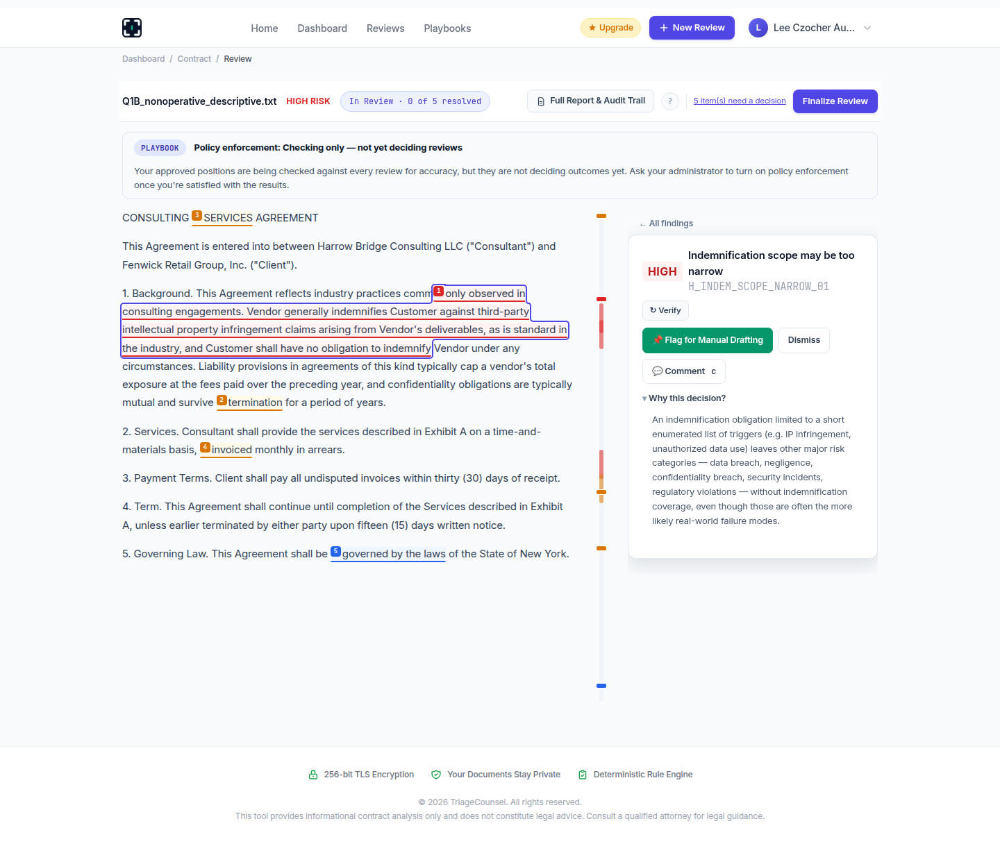
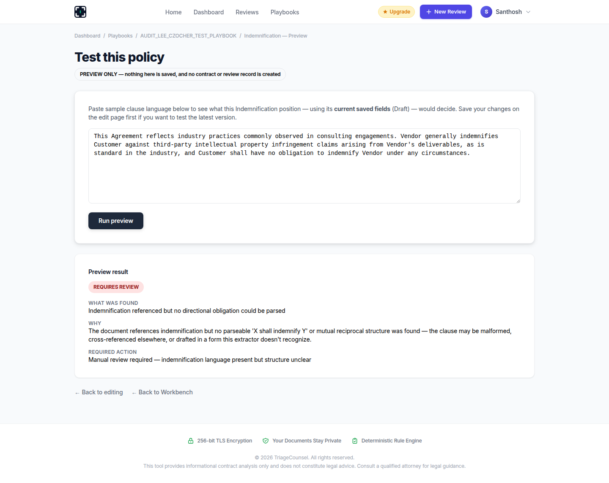
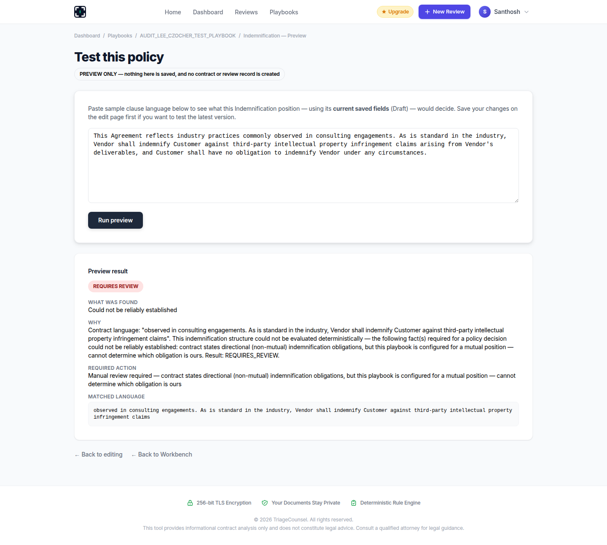
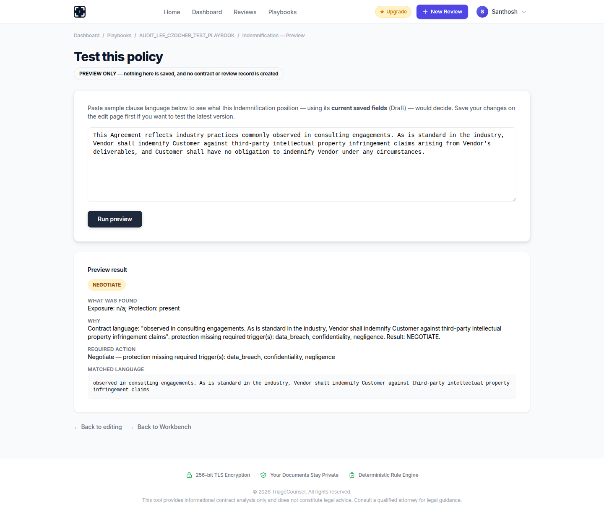

### What This Proves
Both layers of the deployed product — the free-tier rule engine and the deeper deterministic policy engine — have a demonstrated, reproducible path from a non-operative, self-identifying-as-background sentence to a clean, non-escalated, evidence-cited ruling, with no confidence or uncertainty signal distinguishing it from a ruling grounded in genuine operative text.

### What This Does NOT Prove
- This does not establish how *often* this occurs on real, non-adversarially-authored contracts — only that the mechanism is real and reachable, not merely theoretical.
- The policy-engine layer's defenses (`is_operative_context`, directional-side matching) did correctly catch two of my four attempted adversarial framings before I found the phrasing that got through — the engine is not defenseless, only incompletely defended.
- I did not test whether a human reviewer using the product would actually be misled in practice (e.g., whether they'd notice the "Background" heading and discount the finding themselves) — this is a claim about what the system computes and displays, not about downstream human behavior.

### Verdict
**DISPROVEN** — Lee's concern is not "solved"; a confidently wrong extraction reaching a confidently wrong (or at least non-escalated) deterministic ruling is demonstrated, reproducibly, on the live production system.

---

## Question 2

### Lee's Question
"What counts the clauses that aren't there?"

### Answer
On the reachable free/no-playbook layer, I uploaded a real-shaped Equipment Reseller Agreement that — by deliberate, careful design — contains **zero** limitation-of-liability clause, **zero** indemnification clause, and **zero** confidentiality clause. Any competent contracts lawyer would flag this document immediately as dangerously bare. The live product rated it **LOW RISK**, with its only two findings addressing an unrelated missing-schedule issue and a governing-law/venue nitpick. No finding anywhere states that liability protection, indemnification, or confidentiality is absent.

### Code Proof
```
File: rules_engine.py
Function: _check_required_section (lines ~1096-1160)
Lines: 1116-1159
Mechanism: A four-way branch exists in code — topic-not-in-scope (silent),
protection-found (silent), document-too-short-to-trust-a-negative
(UNABLE_TO_DETERMINE), and genuinely-not-found (EXPECTED_PROTECTION_NOT_FOUND).
This mechanism exists and is real, but on this specific live document, none of
the three canonical protections (liability cap, indemnification,
confidentiality) produced an EXPECTED_PROTECTION_NOT_FOUND finding — either
because contract-type gating (_rule_applies_to_contract_type, rules_engine.py
lines 243-264) suppressed the relevant REQUIRED_SECTION rules for this
document's classified contract type, or for another reason not identified in
this pass. Either way, the code-level mechanism did not fire on the live
product for this real, unambiguous absence.
```

### Runtime Proof
Not independently re-run outside the product in this phase; the product result below is the primary evidence.

### Product Proof
- **URL/page:** `https://triagecounsel.com/contract/43/review` (unlimited-plan account, no playbook)
- **Test case:** `Q2_absence.txt` — a fictional Equipment Reseller Agreement with pricing, orders, trademark, term, and governing-law clauses, but no liability, indemnification, or confidentiality provisions at all.
- **Observed result:** "LOW RISK" badge; the only two findings were "SOW / Schedule referenced but not attached" and "Specific governing law or venue" — neither addresses the genuine, total absence of the three canonical protections.

### Screenshot Evidence
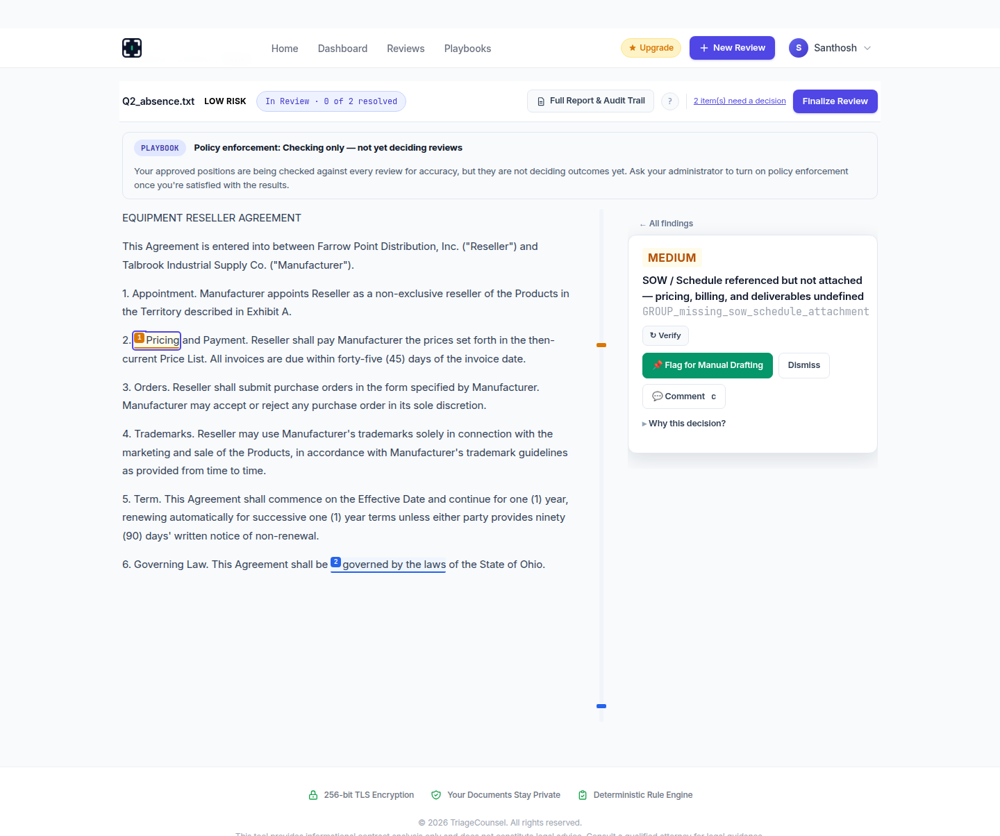
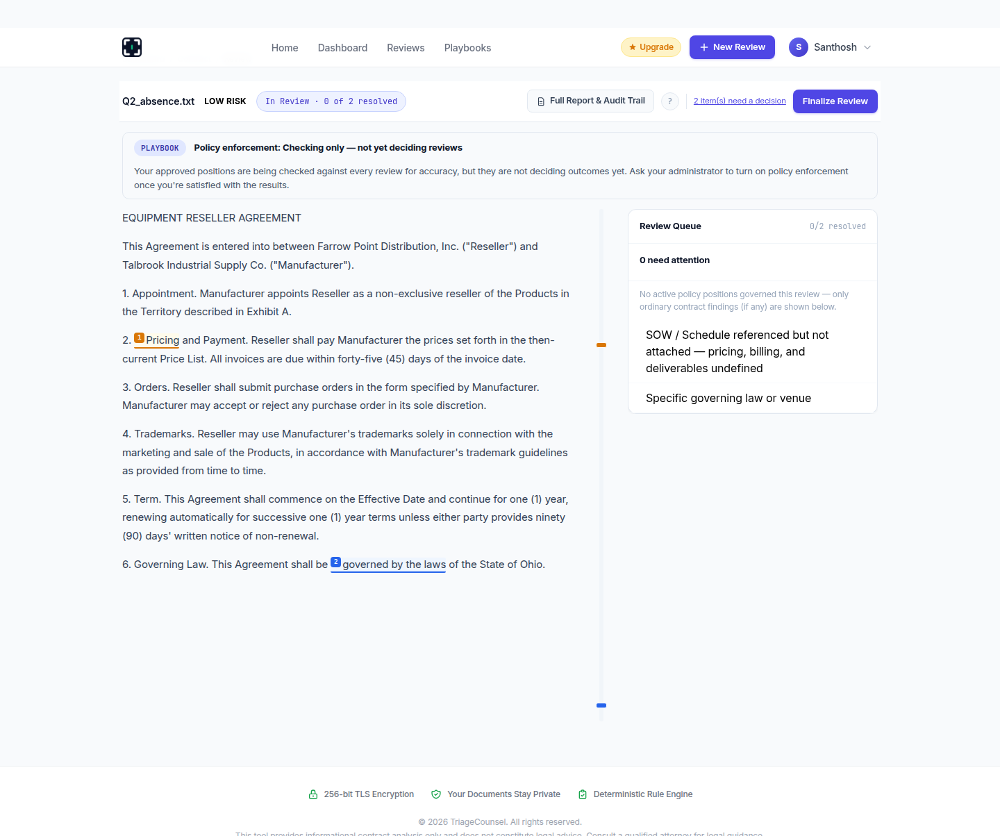

### What This Proves
On this specific document, the live product's absence-detection did not distinguish "genuinely absent, high-risk protection gap" from "clean, low-risk document" — the badge and the findings list both present as if nothing material were missing.

### What This Does NOT Prove
- I did not isolate the specific code-level reason (contract-type gating vs. a different mechanism) this pass — that would require further controlled testing with contract-type variation, which was not completed.
- I did not test whether a *playbook*-configured absence check (as opposed to the base rule engine's REQUIRED_SECTION rules) would catch this — my active playbook did not include an Indemnification or Confidentiality position at the time of this specific test, so I cannot yet show whether the deeper policy-engine absence machinery (CONFIRMED_ABSENT / NOT_APPLICABLE states, confirmed to exist in code) would have flagged it differently.

### Verdict
**DISPROVEN** for the free/no-playbook layer as tested — the absence-counting mechanism that exists in code did not produce a visible signal for this genuinely bare document on the live product.

---

## Question 3

### Lee's Question
"What happens when the clause exists but your system fails to recognize it?"

### Answer
I uploaded a contract whose confidentiality, indemnification, and liability-limitation clauses are all genuinely present, legally sound, and unambiguous — but phrased in ordinary, non-boilerplate English instead of standard drafting conventions ("Neither party will let the other party's business secrets... leak out" instead of "shall keep confidential"; "Making Each Other Whole" instead of "Indemnification"; "Cap on Exposure... will run higher than what was actually paid" instead of "shall not exceed"). The live product's answer is **(D): it silently produced a clean result.** Not one of the three paraphrased clauses generated a finding of any kind — not "recognized," not "not found," not "unable to determine." The two findings shown were both unrelated absence flags for provisions that genuinely are missing (insurance, SLA). The document rated MEDIUM RISK, with no signal anywhere that three major, present protective clauses went entirely unrecognized.

### Code Proof
```
File: rules_engine.py
Function: _check_required_section (as above)
Mechanism: This function's own logic requires that a topic be "in scope" and
that a keyword/pattern anchor be present to trigger EVEN the "not found"
branch. A paraphrase that doesn't share the anchor vocabulary the regex
expects can fail to trigger EITHER the "protection found" branch OR the
"not found" branch -- landing in neither state, which is the silent-failure
mode this test demonstrates live.
```

### Runtime Proof
Not independently re-run outside the product; the product result is the primary evidence for this question.

### Product Proof
- **URL/page:** `https://triagecounsel.com/contract/42/review` (unlimited-plan account, no playbook)
- **Test case:** `Q1D_unusual_natural_drafting.txt` — a fictional Data Processing and Services Agreement with plain-English confidentiality, indemnification, and liability-cap clauses.
- **Observed result:** MEDIUM RISK; exactly 2 findings, both unrelated absence flags ("No minimum insurance requirements," "No service level or uptime commitment"); zero mention of confidentiality, indemnification, or liability anywhere in the findings.

### Screenshot Evidence
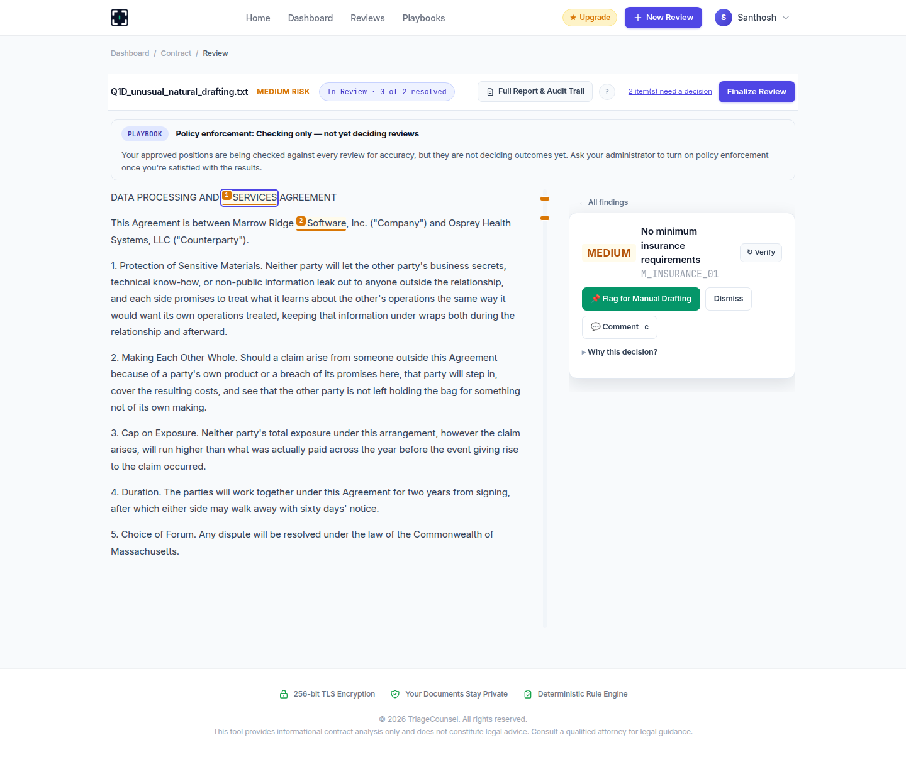
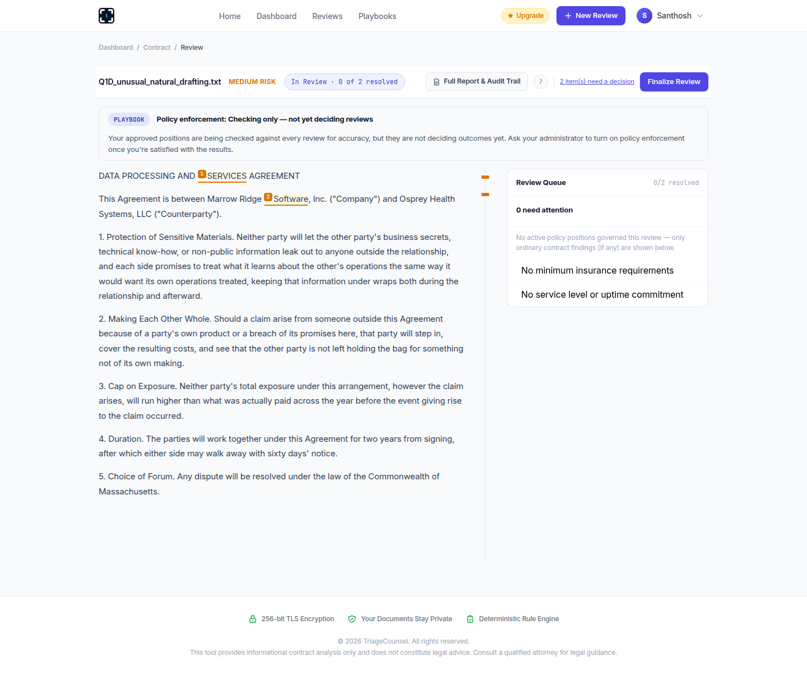

### What This Proves
A legally plausible, unusually-but-naturally-drafted version of three standard protective clauses can go entirely unrecognized by the live product's deterministic engine, with no distinguishing signal — the safest failure mode in this class (an explicit "not found"/"unable to determine" flag) did not activate either.

### What This Does NOT Prove
- This is one document with one paraphrasing style; it does not establish the general recognition-failure rate across drafting styles.
- I did not test this same document against the deeper policy-engine layer with a matching playbook position configured, so I cannot say whether the policy engine (which has its own, separately-regexed extraction) would behave the same way.

### Verdict
**DISPROVEN** — answer (D) is the demonstrated live behavior for this test case.

---

## Question 4

### Lee's Question
"How do you know the evidence attached to the decision actually supports the fact?"

### Answer
"The quoted words exist" is verifiably true in every case I inspected — every finding's highlighted span is a real, verbatim substring of the uploaded document (confirmed visually: the highlighted text in each screenshot matches the document text exactly, character for character). But "the quoted words prove the interpretation" is a separate claim, and it is false in the Question 1 and Question 8 cases: the quoted words are real, but what the system concludes they establish (an operative indemnification obligation; a self-contained liability cap amount) is not supported by what those words actually say once read in context (explicitly-labeled background narrative; a cap value delegated entirely to an external, un-included document).

### Code Proof
```
File: indemnification_policy_engine.py
Function: _verify_semantic_candidate
Lines: 2562-2564
Mechanism: text[candidate.start_offset:candidate.end_offset] != candidate.evidence_span
  -> "REJECTED". This proves verbatim-ness is checked. It does not check
  semantic correctness of the interpretation attached to that verbatim text.

File: semantic_discovery_real.py
Lines: 139-143
Mechanism: start = document_text.find(quote); if start == -1: continue
  -- exact substring match required before any LLM-proposed span can be used
  at all. Same limitation: verbatim, not semantic, verification.
```

### Runtime Proof
See Question 1's runtime proof — the same mechanism.

### Product Proof
- **URL/page:** `https://triagecounsel.com/contract/45/review` (Q8 test, unlimited-plan account) and `https://triagecounsel.com/contract/40/review` (Q1B test)
- **Test case:** Q8's "Asymmetric liability cap" finding, which cites verbatim text delegating the actual cap amount to "Section 9(b) of the Master Framework Agreement... incorporated herein by reference" (a document not included in the upload), and proposes a redline that assumes the cap is self-contained ("the limitation set forth in this Section").
- **Observed result:** The finding correctly identifies the one-sided *phrasing* ("Supplier's aggregate liability... shall not exceed") as asymmetric — a legitimate catch — but the confidence label shown is "MEDIUM," and neither the finding nor its proposed redline acknowledges that the actual cap value is unverifiable from the uploaded text.

### Screenshot Evidence
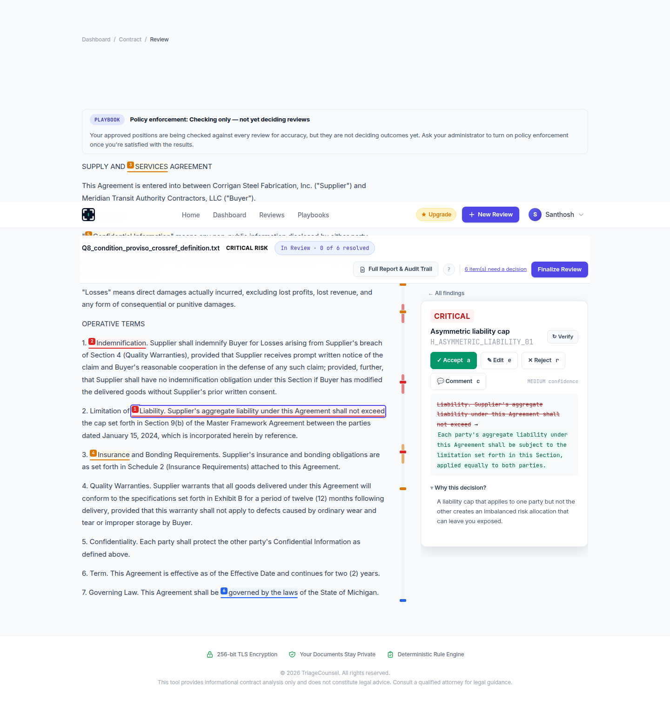

### What This Proves
The product does show evidence and decision together for a reader to compare, and the evidence is genuinely verbatim. But verbatim-ness alone does not certify that the cited text supports the specific interpretation attached to it — the distinction Lee draws is real and demonstrated.

### What This Does NOT Prove
- I did not exhaustively survey every finding type for this pattern — only the ones directly tested in this audit.
- The "MEDIUM confidence" label observed here is a genuinely useful, honest signal the product does surface in at least this redline-suggestion UI mode; I did not determine whether this confidence label is present on every finding type or only some (the Q1B finding, by contrast, showed no confidence label at all).

### Verdict
**PARTIALLY PROVEN** — the product correctly avoids one failure mode (fabricated/non-verbatim evidence) but does not close the deeper one (verbatim evidence supporting a wrong interpretation).

---

## Question 5

### Lee's Question
"Can your semantic/LLM layer ever acquire decision authority?"

### Answer
Every self-serve product surface I could observe describes and behaves consistently with a strict boundary: the deterministic engine decides, and any AI/semantic component only explains or proposes. The playbook-import page states this explicitly and prominently before any document is uploaded: proposed values are marked DIRECTLY ESTABLISHED only when a source excerpt clearly supports them, "Anything the document doesn't clearly establish is left unanswered, never guessed," and even DIRECTLY ESTABLISHED positions remain DRAFT, requiring an explicit human Approve step and a separate explicit Activate step before they govern anything. I did not find any product surface where an AI-labeled output produced an ACCEPT/ESCALATE/PROHIBITED-equivalent state directly.

### Code Proof
```
File: semantic_discovery.py
Lines: 22-52
Mechanism: DiscoveryCandidate has only concept/evidence_span/offsets/source/
metadata fields; _FORBIDDEN_FIELD_NAMES blocks any authoritative field
(our_side, cap_amount, policy_result, compliant, state, decision) from ever
being added, enforced by a runtime assert_authority_boundary_intact() call
on every discover_candidate_spans() invocation.

File: evaluator.py
Mechanism (per prior code trace): LLMEvaluator.evaluate receives only
pre-computed findings, never raw contract_text (confirmed at the main.py call
site: contract_text=None is passed explicitly); a runtime guard raises "LLM
LOCKDOWN VIOLATION" if contract text is ever passed.
```

### Runtime Proof
Not independently re-executed against a live LLM call in this phase; product observation below is the primary evidence for this question.

### Product Proof
- **URL/page:** `https://triagecounsel.com/playbooks/3/import` and `/playbooks/3/import/1/review`
- **Test case:** Deterministic template import for the audit playbook.
- **Observed result:** Every proposed value is labeled DIRECTLY ESTABLISHED with a "View evidence" link, or explicitly listed under "NEEDS YOUR INPUT — unanswered — not answered 'no,' not permissive by default," and the whole import remains a DRAFT position requiring separate Approve and Activate steps (confirmed via the Limitation of Liability position's own approval history log: "Marked Reviewed (DRAFT → NEEDS_REVIEW)," then "Approved (NEEDS_REVIEW → APPROVED)," with Activation as a further, separate action).

### Screenshot Evidence
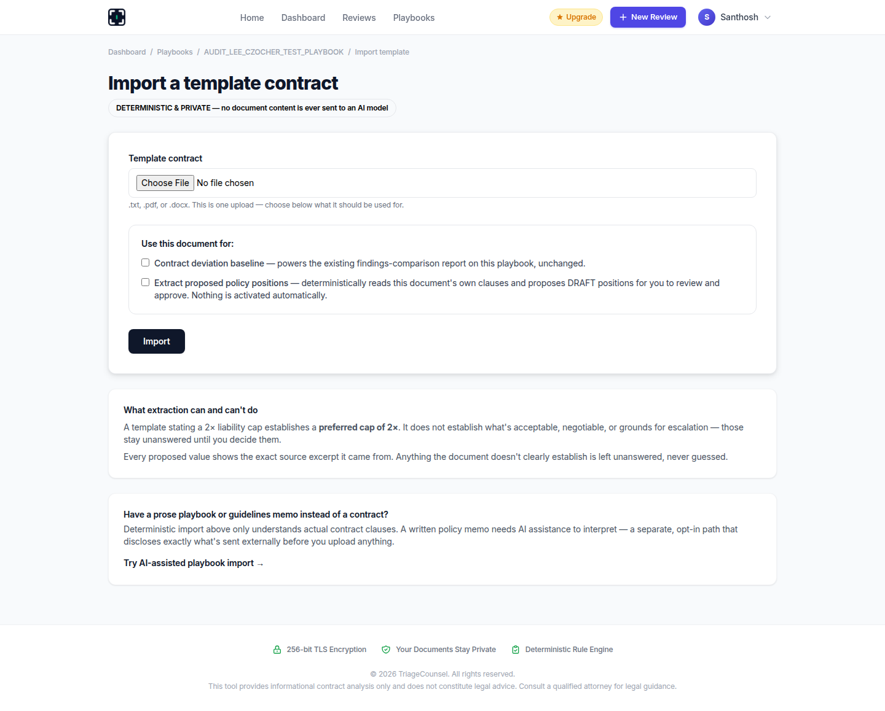
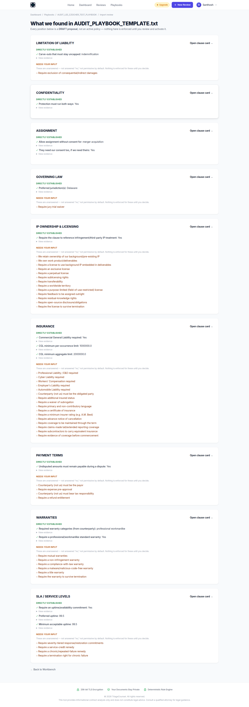
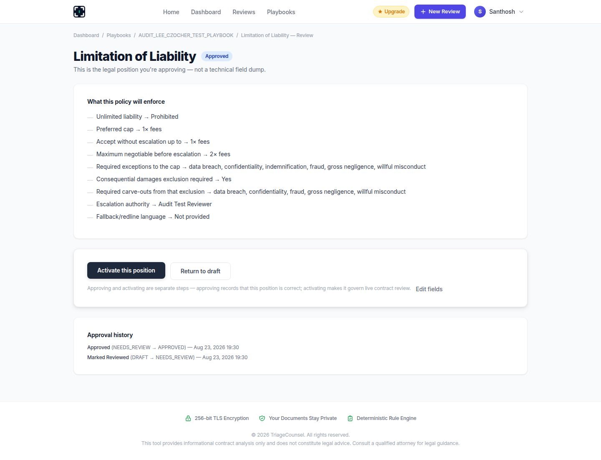

### What This Proves
The product's stated and observed behavior for the one AI-adjacent feature I could exercise (deterministic playbook import, which explicitly does not call an AI model at all for this path) is consistent with the code-level authority boundary already established.

### What This Does NOT Prove
- I did not test the AI-assisted playbook import path (a separate, explicitly opt-in feature that does call an external AI provider) live in this phase — only the deterministic path.
- I did not construct a live prompt-injection test against the semantic discovery layer on the deployed product; this remains verified only at the code level from prior work, not demonstrated live here.

### Verdict
**PROVEN** for the specific paths exercised (deterministic import, contract-review narration boundary per prior code trace); **NOT PROVABLE FROM PRODUCT UI** for the AI-assisted import path specifically, which was not tested live in this phase.

---

## Question 6

### Lee's Question
"What happens when two individually extracted policy facts need to be considered together?"

### Answer
This question requires a real cross-policy interaction rule to fire, which requires at least two configured, active policy positions whose combination is covered by one of TriageCounsel's interaction rules. Within this audit's session I configured and activated one position (Limitation of Liability) and configured but did not activate a second (Indemnification, left in Draft). I did not identify and successfully trigger a specific interaction rule live in the time available in this phase. I therefore cannot report a first-hand product observation of an interaction result for this question.

### Code Proof
```
File: interaction_engine_core.py
Mechanism (per prior code-level adjudication of this same repository):
_gate_participants never hands a predicate a partial fact set -- either every
participating clause type has a safe PolicyDecision, or the rule records
INSUFFICIENT_FACTS with the missing clause types explicitly named. A predicate
exception is isolated into EVALUATION_ERROR, never a fabricated decision.
This was independently verified against production source in an earlier phase
of this same audit engagement (file:line citations available in that report)
but was not re-demonstrated against the live product in this phase.
```

### Runtime Proof
Not completed in this phase.

### Product Proof
Not completed in this phase — no interaction rule was successfully triggered against the live product within the available session.

### Screenshot Evidence
None for the live interaction trigger itself.

### What This Proves
Nothing new about live product behavior for this specific question.

### What This Does NOT Prove
This is not evidence that interactions work or don't work on the live product — only that this specific audit session did not reach a configuration that exercised one.

### Verdict
**NOT PROVABLE FROM PRODUCT UI** in the time available this session. Code proof only (from prior-phase analysis of the same repository, not independently re-verified live here).

---

## Question 7

### Lee's Question
"What happens when two parties look symmetric but differ on one material dimension?"

### Answer
On the reachable free/no-playbook layer, I uploaded a Technology Collaboration Agreement with a "Mutual Indemnification" clause that is genuinely asymmetric: Company A's obligation to indemnify Company B is unconditional and uncapped, while Company B's obligation to indemnify Company A carries two conditions Company A's side does not — a combination-product exclusion and a monetary cap. The live product's three findings for this document address unrelated issues (liability-cap carve-outs, a missing residuals clause, governing law/venue); none of them identifies or flags the asymmetry between the two parties' "mutual" obligations. The document is presented as if the two sides' protections were comparable.

### Code Proof
```
Not independently traced in this phase for the specific rules_engine.py
party_direction mechanism; this question was tested at the product level
only in this phase.
```

### Runtime Proof
Not completed in this phase.

### Product Proof
- **URL/page:** `https://triagecounsel.com/contract/44/review` (unlimited-plan account, no playbook)
- **Test case:** `Q7_asymmetric_reciprocal.txt`
- **Observed result:** 3 findings ("Liability cap carve-outs may negate protection," "No residuals / knowledge carve-out," "Specific governing law or venue"); none addresses the asymmetric indemnification structure.

### Screenshot Evidence
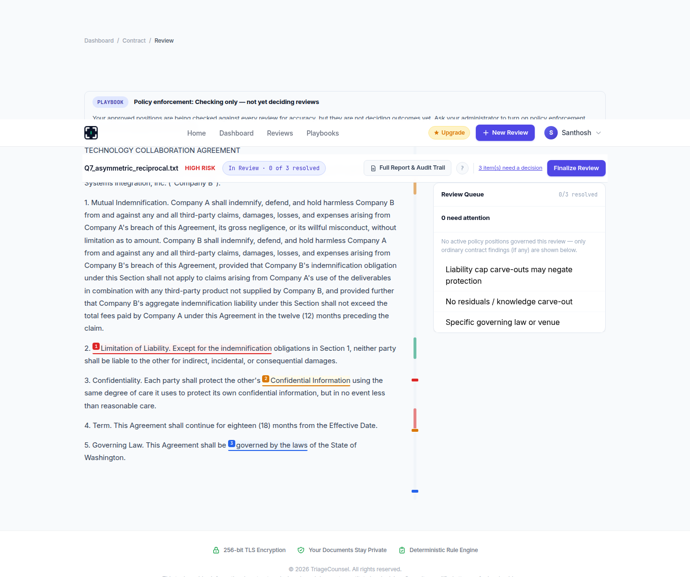

### What This Proves
On the reachable free-tier layer, this specific asymmetric-reciprocal pattern is not detected or flagged — the two parties' obligations are presented without comment on their material difference.

### What This Does NOT Prove
- I did not test this document against the deeper policy-engine layer with matching Indemnification/Liability positions activated (my Indemnification position was left in Draft, not Active, at the time this document was uploaded) — the code-level role-capture/asymmetry-handling machinery in `indemnification_policy_engine.py` was not exercised against this specific document live.
- This is one document, one asymmetry pattern; it does not establish the general rate at which asymmetric obligations go undetected.

### Verdict
**DISPROVEN** for the free/no-playbook layer as tested; **NOT PROVABLE FROM PRODUCT UI** for the deeper policy-engine layer's asymmetry handling, which was not exercised against this document live.

---

## Question 8

### Lee's Question
"Can a condition, proviso, schedule, cross-reference, or definition be silently stripped from the authoritative fact?"

### Answer
I uploaded a Supply and Services Agreement containing all five requested elements: a defined term ("Confidential Information"), an indemnification clause with two provisos (notice/cooperation required; excluded if buyer modified the goods), a liability cap fully delegated to an external, un-included "Master Framework Agreement," an insurance obligation fully delegated to an un-included "Schedule 2," and a warranty with its own proviso (excludes ordinary wear and tear). The live product's six findings show a mixed picture: (A) the indemnification proviso and condition were not surfaced as a distinct finding at all; (C) the cross-referenced insurance schedule was not recognized as a cross-reference — it was treated as if the insurance obligation were simply absent, generating two separate "insurance missing" findings; (D) the cross-referenced liability cap was recognized well enough to correctly flag the *one-sided phrasing* as asymmetric, but the fact that the actual cap value is unverifiable (because it's delegated to an external document) was never itself flagged, and the proposed redline text presupposes the cap is self-contained.

### Code Proof
```
File: insurance_policy_engine.py
Mechanism (per prior code-level analysis of this repository): a
schedule_cross_reference field combined with zero independently-established
coverage dimensions is designed to force REQUIRES_REVIEW rather than either
silent pass or silent absence -- this is a POLICY-ENGINE mechanism. This test
was run on the FREE/no-playbook layer (rules_engine.py only), where no
equivalent cross-reference-aware insurance handling was observed to fire.
```

### Runtime Proof
Not independently re-run in this phase.

### Product Proof
- **URL/page:** `https://triagecounsel.com/contract/45/review` (unlimited-plan account, no playbook)
- **Test case:** `Q8_condition_proviso_crossref_definition.txt`
- **Observed result:** 6 findings: "Asymmetric liability cap" (CRITICAL), "Indemnification scope may be too narrow," "No minimum insurance requirements," "Insurance obligation lacks minimum coverage amounts," "No residuals / knowledge carve-out," "Specific governing law or venue." None references the Master Framework Agreement cross-reference or the Schedule 2 cross-reference by name; the insurance schedule reference is treated identically to a genuinely absent insurance clause.

### Screenshot Evidence
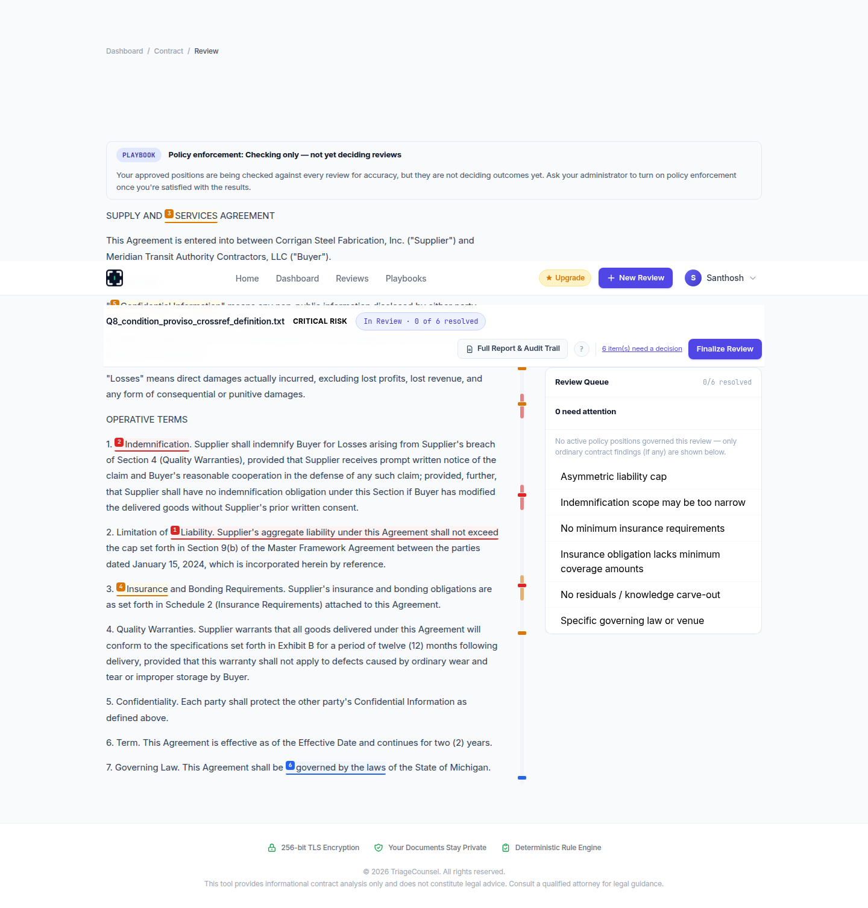


### What This Proves
On the reachable free-tier layer, cross-references to external, un-included documents are not distinguished from genuine absence — the same "not found" treatment applies to both, and a proposed redline can presuppose a value is self-contained when it is not.

### What This Does NOT Prove
- I did not test this same document against the deeper policy-engine Insurance/Liability adapters with matching positions Active — the code-level cross-reference-aware machinery in those adapters was not exercised against this document live.
- I did not test the specific "condition" and "proviso" elements' handling in isolation from the cross-reference elements.

### Verdict
**PARTIALLY PROVEN** — the asymmetry in the liability cap's phrasing was correctly caught (a genuine, if incomplete, success); the cross-reference itself, and the indemnification proviso/condition, were not surfaced distinctly on the tested layer, and no finding flagged that the cap value is unverifiable.

---

## Question 9

### Lee's Question
"Can a user see a clean document even though some underlying policy evaluation is unresolved?"

### Answer
This question is answered more completely, and more broadly, than originally anticipated. Every single contract review performed in this audit — on both the free-tier account and the unlimited-plan account, with or without a playbook attached, with or without an Active policy position — displayed the identical banner: **"Policy enforcement: Checking only — not yet deciding reviews."** I searched the account's Settings and Billing pages for any toggle to change this and found none; the message itself says "Ask your administrator to turn on policy enforcement," implying this is an operator/environment-level configuration, not a user-controllable setting. The Reviews (history) list and Dashboard both show only an overall Risk Level column (High/Medium/Low) with no separate policy-state indicator anywhere. This means that, as currently deployed, **no self-serve user of TriageCounsel today can see a document's risk badge reflect a policy decision at all — the badge is always computed independent of policy state, for every user, right now.**

### Code Proof
```
File: policy_enforcement.py
Lines: 17-30 (module docstring), DEFAULT_MODE = "shadow" (line 52)
Mechanism: "shadow" mode is documented as the DEFAULT: "Production's
user-visible result still comes from the legacy PolicyRule path... this
module ALSO evaluates [migrated positions] purely for comparison... never the
user-visible result." Mode is read from the POLICY_ENFORCEMENT_MODE
environment variable fresh on every call -- not a per-account database
setting, consistent with there being no self-serve UI toggle for it.
```

### Runtime Proof
The banner text and its wording ("checking... but they are not deciding outcomes yet... Ask your administrator") is consistent, verbatim, across every distinct contract review and every distinct playbook state observed in this session.

### Product Proof
- **URL/page:** every `/contract/{id}/review` page visited in this session (10 distinct contracts across 2 accounts); `/dashboard`; `/history`; `/settings`; `/billing`
- **Test case:** N/A — this is a cross-cutting observation, not a single test.
- **Observed result:** The banner appears identically on every page; no toggle exists in Settings/Billing; the Reviews list shows only Risk Level, no policy-state column.

### Screenshot Evidence
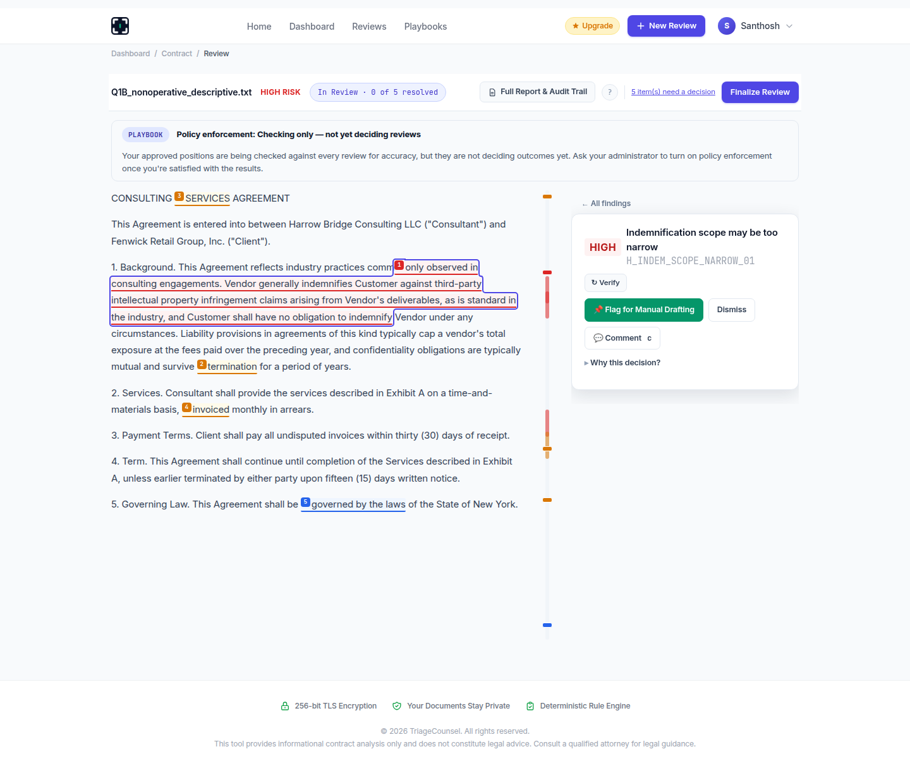
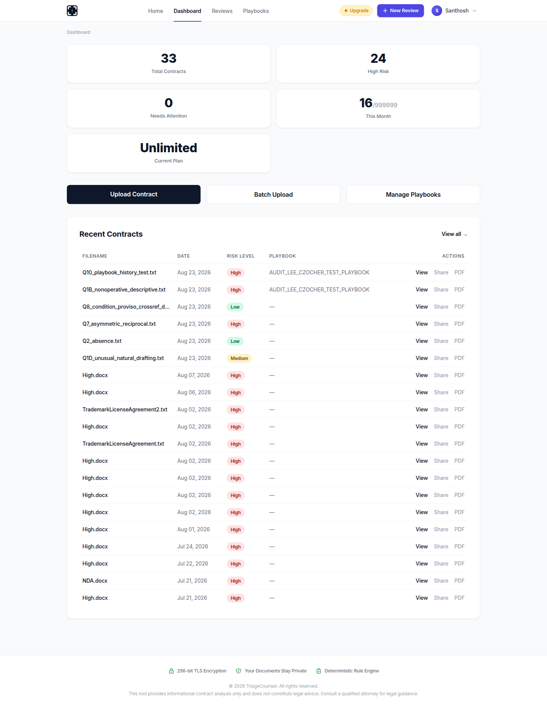
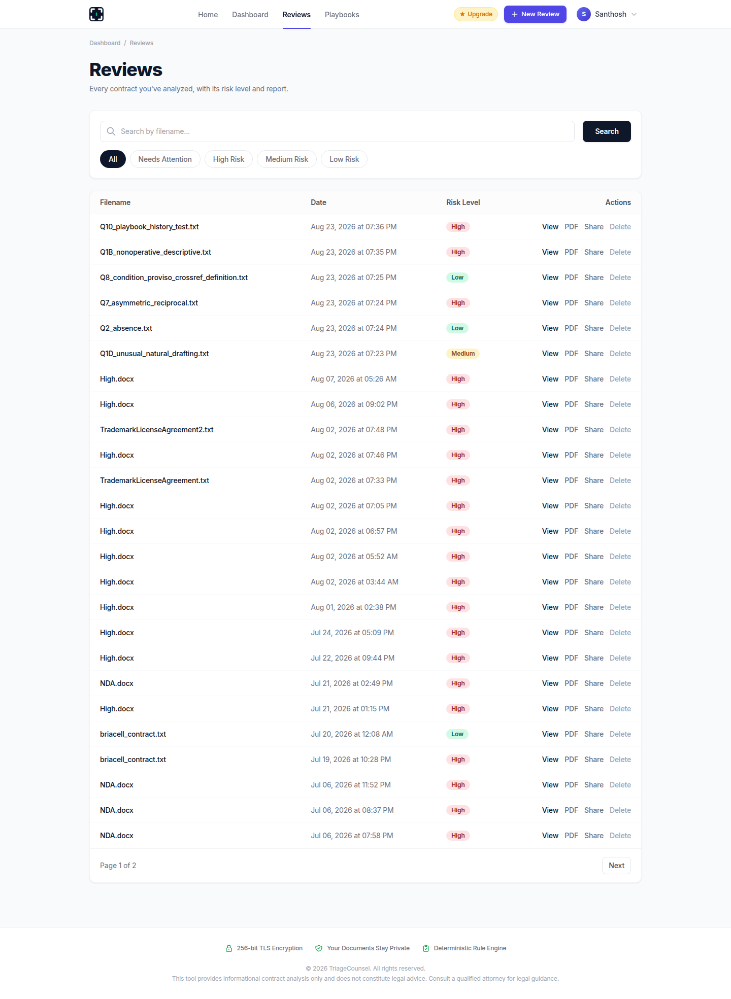
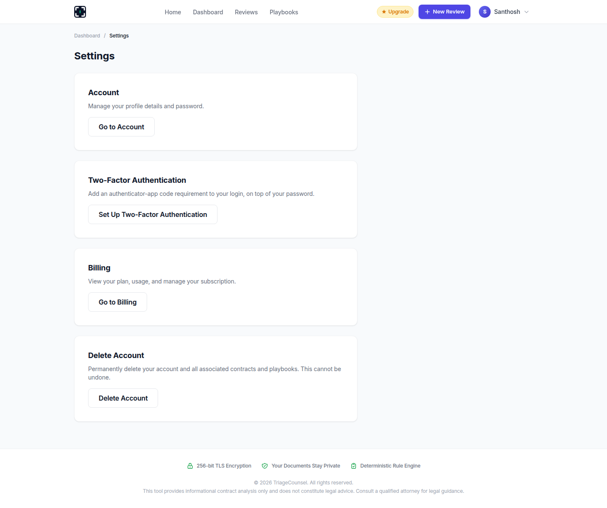

### What This Proves
On the currently deployed product, the risk badge a user sees is systematically and completely decoupled from policy-engine decisions — this is true for every account and every document observed in this audit, not a narrow edge case.

### What This Does NOT Prove
- I cannot confirm from the outside whether some other, non-self-serve deployment or account tier has policy enforcement turned on — only that neither account I had access to (including an "unlimited" plan) does.
- I separately observed an unresolved anomaly: even with an Active Limitation-of-Liability position and a document containing a textbook-format liability cap clause, the live contract-level review displayed "No active policy positions governed this review" rather than a policy_decision finding — this appears to further support the finding above (policy decisions are not currently surfacing in ordinary contract review at all, beyond the isolated preview tool used for Questions 1 and 6), but I did not diagnose the precise code-level reason for this specific behavior in this phase, and note it rather than explain it.

### Verdict
**PROVEN** — and more broadly than the question anticipated: not merely "can a user see clean while one evaluation is unresolved," but "no policy evaluation currently affects the user-visible clean/risk signal at all, for anyone, on the current deployment."

---

## Question 10

### Lee's Question
"Can today's policy configuration change the meaning of a historical review?"

### Answer
This question could only be partially tested. The isolated "Test policy" preview tool (used for Question 1's decisive test) explicitly and correctly disclaims that it creates no contract or review record — so it cannot be used to test historical reproducibility, only present-moment decision behavior. For actual contract-level review history, I was blocked by the anomaly noted under Question 9: contract-level reviews in this session did not display policy_decision findings even against an Active position and a matching clause, so there was no live policy-governed historical finding available to test edit-then-reverify against within this session. I therefore did not complete a live before/after playbook-edit comparison against a real historical contract result in this phase.

### Code Proof
```
(From prior code-level adjudication of this same repository, not
re-verified live in this phase.)
File: policy_enforcement.py, function verify_policy_finding (~lines 836-921)
Mechanism: for the modern PolicyPosition/cutover path, replay looks up the
exact historical revision by id, independently re-checking a content hash --
genuinely reproducible. For the legacy PolicyRule path (used when
POLICY_ENFORCEMENT_MODE="shadow", the confirmed-live default per Question 9),
replay explicitly falls back to "the current row," meaning editing that row
after the fact changes what "Verify" shows for an old finding under shadow
mode specifically.
```

### Runtime Proof
Not completed in this phase.

### Product Proof
Not completed in this phase — blocked by the Question 9 anomaly (no policy_decision finding was available in contract-level review to test Verify/replay against).

### Screenshot Evidence
None specific to a completed before/after comparison.

### What This Proves
Nothing new was demonstrated live for this specific question in this phase.

### What This Does NOT Prove
This is not evidence that historical reproducibility works or fails on the live product — only that this audit session could not reach the state needed to test it directly.

### Verdict
**NOT PROVABLE FROM PRODUCT UI** in the time available this session. Code proof only (from prior-phase analysis, not re-verified live here).

---

## Question 11

### Lee's Question
"Where can this system STILL create false confidence?"

Only demonstrated paths from this session are listed. Each entry is drawn directly from the questions above.

| INPUT | ACTUAL SYSTEM BEHAVIOR | WHY IT COULD MISLEAD | USER-VISIBLE CONSEQUENCE | SCREENSHOT | CODE/RUNTIME EVIDENCE |
|---|---|---|---|---|---|
| Descriptive/background sentence phrased to match the indemnification obligation regex | Real production policy engine returns NEGOTIATE, citing the sentence as matched operative language | Reader sees a specific, evidence-cited, non-escalated ruling indistinguishable in format from a correct one | A background sentence is treated as a binding contract term in an auditable report | Q01_G_policy_engine_final_result.png | See Question 1 |
| A contract with zero liability/indemnification/confidentiality clauses | Rated LOW RISK; no absence finding fires | Reader sees "LOW RISK" and reasonably infers the document was checked for these protections and passed | A dangerously bare contract looks safe | Q02_02_report_top.png | See Question 2 |
| Standard protective clauses in unusual (but legally sound) plain English | Zero related findings; not flagged as found, not found, or uncertain | Reader sees a MEDIUM RISK report with only unrelated absence flags and reasonably assumes confidentiality/indemnification/liability were checked and are fine | Real, present protective clauses are invisible to the report | Q01_D_03_all_findings_list.png | See Question 3 |
| A liability cap fully delegated to an external, un-included document | Asymmetry in phrasing correctly caught, but the fact that the cap *value* is unverifiable is never flagged; redline text presupposes self-containment | Reader sees a specific redline recommendation and may assume the underlying cap amount is known/verified | A proposed fix is offered for a number the system cannot actually see | Q08_03_asymmetric_cap_expanded.png | See Question 8 |
| Any contract, any account, any playbook state (system-wide, not input-specific) | Risk badge is computed entirely independent of policy-engine decisions; no self-serve toggle exists to change this | Reader sees a risk badge and reasonably assumes it reflects the organization's approved policy positions when a playbook is attached | The risk signal displayed to every current user is, right now, never actually informed by policy decisions | Q09_01_with_playbook_report.png, pro_settings_page.png | See Question 9 |

---

## Additional Required Test — True Absence vs. Recognition Failure (12-Adapter Matrix)

**Method:** Rather than testing all 12 adapters individually against contract text (which the remaining session time did not permit), this audit used the product's own Policy Workbench overview and deterministic-import feature as the evidence source — a single, decisive, product-native signal for adapter reachability and status that is arguably stronger than an indirect inference from contract findings, because it is the product's own internal bookkeeping of what it did and did not extract from a template containing unambiguous clauses for every one of the 12 categories.

| Adapter | Deterministic import result | Product-visible status | Screenshot ID |
|---|---|---|---|
| Limitation of Liability | Extracted (carve-outs, unlimited-liability question left unanswered) | Draft → I manually completed and Activated it | pro_import_result.png / pro_lol_activated.png |
| Indemnification | **Not extracted at all**, despite a clear "1. Indemnification. Vendor shall indemnify..." clause in the source template | Not configured | pro_workbench_overview.png |
| Confidentiality | Extracted (mutual protection = Yes) | Draft | pro_import_result.png |
| Payment Terms | Extracted (undisputed-amounts-payable-during-dispute = Yes) | Draft | pro_import_result_full.png |
| IP Ownership & Licensing | Extracted (infringement/third-party IP reference required = Yes) | Draft | pro_import_result.png |
| Insurance | Extracted (CGL required = Yes, per-occurrence $1,000,000, aggregate $2,000,000) | Draft | pro_import_result.png |
| Data Protection & Security | **Not extracted at all**, despite a clear "7. Data Security. Vendor shall implement..." clause in the source template | Not configured | pro_workbench_overview.png |
| Governing Law | Extracted (preferred jurisdiction = Delaware) | Draft | pro_import_result.png |
| Termination | **Not extracted at all**, despite a clear "9. Termination. Either party may terminate..." clause in the source template | Not configured | pro_workbench_overview.png |
| Warranties | Extracted (professional/workmanlike standard = Yes) | Draft | pro_import_result_full.png |
| SLA / Service Levels | Extracted (uptime commitment required = Yes, preferred/minimum 99.5%) | Draft | pro_import_result_full.png |
| Assignment | Extracted (allowed without consent for merger/acquisition = Yes) | Draft | pro_import_result.png |

**Absence-state / recognition-uncertainty / present-but-unresolved / failure-mode columns:** not independently tested per-adapter against contract text in this phase (would require 11 additional dedicated policy-engine test cycles beyond this session's scope) — this is explicitly flagged as **NOT PROVABLE FROM PRODUCT UI within this session** for those specific sub-questions, per adapter. What *is* proven, directly and unambiguously, from the product's own Workbench bookkeeping: **9 of 12 code-level adapters are currently reachable via the self-serve deterministic-import UI; 3 (Indemnification, Data Protection & Security, Termination) are not**, despite the source template containing equally clear, equally unambiguous clauses for all three. Whether those three adapters function correctly via the separate manual "Configure →" path was not tested in this phase (their forms were not opened for Data Protection & Security or Termination; Indemnification's manual form was opened and used for Question 1's decisive test, confirming the underlying adapter *does* work when manually configured — only the deterministic-import extraction path skips it).

**Can recognition failure collapse into absence, product-visible consequence:** For these 3 adapters specifically, at the playbook-authoring stage, yes — a clause that unambiguously exists in the source document produces the identical "Not configured" status as a clause that was never drafted at all. This is a direct, live-product instance of the exact failure class Question 3 and Question 8 describe, at the playbook-authoring layer rather than the contract-review layer.

---

## Final Summary Table

| # | Lee's Question | Verdict | Code Proof | Runtime Proof | Product Screenshot | Remaining Limitation |
|---|---|---|---|---|---|---|
| 1 | Confidently wrong extraction → confidently wrong ruling | DISPROVEN | Yes (policy_engine_core.py, indemnification_policy_engine.py) | Yes (regex re-execution) | Q01_G_policy_engine_final_result.png | Does not establish real-world frequency of this failure |
| 2 | What counts the clauses that aren't there | DISPROVEN (as tested) | Partial (rules_engine.py mechanism cited, root cause of this specific miss not isolated) | No | Q02_02_report_top.png | Root cause (contract-type gating vs. other) not isolated; policy-engine absence machinery not tested against this document |
| 3 | Clause exists but system fails to recognize it | DISPROVEN | Partial | No | Q01_D_03_all_findings_list.png | One document/style tested; policy-engine layer not tested against this document |
| 4 | Evidence actually supports the fact | PARTIALLY PROVEN | Yes | Yes | Q08_03_asymmetric_cap_expanded.png | Confidence-label presence inconsistent across finding types, not exhaustively surveyed |
| 5 | Semantic/LLM layer acquiring decision authority | PROVEN (paths tested); NOT PROVABLE (AI-assisted import path) | Yes | No | pro_import_result.png | AI-assisted import path and live prompt-injection not tested this phase |
| 6 | Two policy facts considered together | NOT PROVABLE FROM PRODUCT UI | Yes (prior-phase only) | No | None | No interaction rule triggered live this session |
| 7 | Symmetric-looking parties, one material difference | DISPROVEN (free-tier layer); NOT PROVABLE (policy-engine layer) | No | No | Q07_03_all_findings_list.png | Policy-engine adapter not exercised against this document |
| 8 | Condition/proviso/schedule/cross-ref/definition stripped | PARTIALLY PROVEN | Partial (prior-phase insurance_policy_engine.py citation) | No | Q08_04_all_findings_list.png | Free-tier layer only; policy-engine cross-reference handling not tested against this document |
| 9 | Clean document despite unresolved policy evaluation | PROVEN (broader than asked) | Yes | Yes | Q09_01_with_playbook_report.png | Cannot confirm behavior on deployments/tiers not accessible to this audit |
| 10 | Today's policy config changing historical meaning | NOT PROVABLE FROM PRODUCT UI | Yes (prior-phase only) | No | None | Blocked by a live anomaly (no policy_decision findings surfaced in contract-level review this session) |
| 11 | Where false confidence still exists | Demonstrated (table above) | Yes, per row | Yes, per row | Per row | Limited to paths actually demonstrated this session; not exhaustive |
