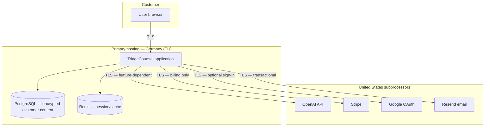

# TriageCounsel — Subprocessor & Data Flow Annex (Internal / Customer Diligence)

**Document type:** Internal operational annex — suitable for sharing with enterprise customers, privacy teams, and legal counsel during vendor diligence, DPA negotiation, and security questionnaires.

**Public companion:** [Subprocessors page](https://triagecounsel.com/security/subprocessors) | [Privacy Policy](https://triagecounsel.com/privacy) | [Security page](https://triagecounsel.com/security)

**Version:** 1.0  
**Last updated:** September 2026  
**Prepared by:** TriageCounsel (operating entity details per customer agreement; see §2)

---

## 1. Purpose and scope

This annex provides **detailed, diligence-grade** information about:

- Which third parties process personal data and customer content on behalf of TriageCounsel
- What categories of data each subprocessor receives
- Where data is stored and transferred
- How contract content flows through the platform, including all AI-assisted paths
- Encryption, retention, deletion, and residual-data behavior
- Security and audit controls relevant to subprocessors

This document **supplements** (does not replace) the public Subprocessors page, Privacy Policy, Terms of Service, and any executed **Data Processing Agreement (DPA)** or pilot/evaluation agreement with a specific customer.

**In scope:** Production environment for triagecounsel.com as operated by TriageCounsel.

**Out of scope (not disclosed in this annex):** Internal infrastructure identifiers (hostnames, IP addresses, firewall rules, container orchestration details, credentials, or non-production environments).

---

## 2. Service provider identity

| Field | Value |
|-------|-------|
| **Trade name** | TriageCounsel |
| **Service** | Connected contract review platform — deterministic policy engines, playbook comparison, optional AI-assisted explanations and evidence discovery |
| **Primary production region** | European Union — Germany (Hetzner Cloud, eu-central) |
| **Legal entity** | Set via `LEGAL_ENTITY_NAME`, `LEGAL_ENTITY_STATE`, `LEGAL_ENTITY_ADDRESS` environment configuration after LLC formation; displayed on Privacy/Terms pages when configured |
| **Contact for privacy/security diligence** | privacy@triagecounsel.com (or address specified in customer agreement) |

**Role under GDPR (typical B2B SaaS):**

- TriageCounsel acts as **Processor** for customer-uploaded contract content and associated account data, processing only on documented instructions from the customer (Controller), except where TriageCounsel is Controller for its own account-management, billing, and product-analytics data.
- Exact role allocation should be confirmed in the executed DPA.

---

## 3. Summary subprocessor register

| # | Subprocessor | Legal entity / HQ | Processing location(s) | Primary purpose | Contract content? |
|---|--------------|-------------------|------------------------|-----------------|-------------------|
| 1 | **Hetzner Online GmbH** | Germany | Germany (EU) | Infrastructure hosting — application runtime, PostgreSQL database, Redis cache | **Yes** — stored encrypted at rest |
| 2 | **OpenAI, L.L.C.** | United States | US and other OpenAI API regions (see OpenAI documentation) | AI-assisted features (see §6) | **Yes** — scope varies by feature (excerpts to full document text) |
| 3 | **Stripe, Inc.** | United States | US and other Stripe regions (see Stripe documentation) | Payment processing, subscription lifecycle | **No** — billing metadata only |
| 4 | **Google LLC** | United States | US and other Google regions (see Google documentation) | Optional OAuth sign-in (`openid email profile`) | **No** |
| 5 | **Resend, Inc.** | United States | United States | Transactional email (password reset, notifications) | **No** — recipient address + message body only |

**Alternative email path:** If `RESEND_API_KEY` is not configured, the operator may use a generic **SMTP** provider instead. That provider becomes a subprocessor for transactional email only. Confirm active provider during diligence.

**Not subprocessors (clarification):**

- **PostgreSQL and Redis** run on the same Hetzner-hosted infrastructure — they are not separate third-party SaaS databases.
- **Original uploaded files (PDF/DOCX bytes)** are not persisted to object storage or any third-party file host.

---

## 4. Personal data and customer content inventory

### 4.1 Account and authentication data

| Data element | Stored by TriageCounsel | Encrypted at rest | Shared with subprocessors |
|--------------|-------------------------|-------------------|---------------------------|
| Email address | Yes | No (indexed for login) | Google (OAuth only, if used); Resend/SMTP (delivery); Stripe (billing contact) |
| Name, company | Yes | No | Google (OAuth profile, if used) |
| Password hash | Yes (PBKDF2-HMAC-SHA256) | No | None |
| Google subject ID (`google_sub`) | Yes (OAuth accounts) | No | Google (authentication flow) |
| MFA secret (TOTP) | Yes | **Yes** (EncryptedText) | None |
| MFA recovery codes | Yes | No (hashed record) | None |
| Stripe customer/subscription IDs | Yes | No | Stripe |

### 4.2 Contract and playbook content (customer confidential data)

| Data element | Stored by TriageCounsel | Encrypted at rest | Shared with subprocessors |
|--------------|-------------------------|-------------------|---------------------------|
| Original upload bytes (PDF/DOCX) | **No** — processed in memory only | N/A | None (not retained) |
| Extracted contract text | Yes | **Yes** (EncryptedText) | OpenAI (when AI features run — see §6) |
| Deterministic findings, policy decisions, deviations | Yes | **Yes** (EncryptedJSON) | OpenAI (excerpts/context in explanation path; full text in fact-admission/playbook paths) |
| LLM explanation JSON | Yes | **Yes** (EncryptedJSON) | Generated by OpenAI; stored locally after return |
| Playbook template text | Yes | **Yes** (EncryptedText) | OpenAI (AI-assisted import only, if enabled) |
| Share-link tokens / optional share passwords | Yes | Password hashed | None |

### 4.3 Operational, analytics, and audit data

| Data element | Stored by TriageCounsel | Encrypted at rest | Shared with subprocessors |
|--------------|-------------------------|-------------------|---------------------------|
| IP address, user agent | Yes (audit log, analytics) | No | None |
| Signup/acquisition metadata (UTM, referrer, geo) | Yes | No | None |
| Upload metadata (filename, SHA-256, file size, processing time) | Yes | No | None |
| Append-only audit events | Yes | No | None |

**Important:** Analytics and audit records may **outlive** deleted contracts and deleted user accounts (see §9).

---

## 5. End-to-end data flows

### 5.1 High-level architecture

### 5.2 Contract upload and analysis flow

1. **Upload (customer → TriageCounsel, TLS)**
   - User submits PDF, DOCX, or TXT (max 10 MB).
   - File bytes are read into application memory for text extraction (PyPDF2 / python-docx).
   - **Original file bytes are not written to disk or object storage.**

2. **Text extraction and persistence**
   - Extracted plain text is stored in PostgreSQL as `contract_text` (EncryptedText — AES-256-GCM).
   - Filename and upload metadata are stored (filename is not encrypted; content is).

3. **Deterministic analysis (no third party)**
   - Rule engine and twelve policy adapters evaluate extracted text on the application server.
   - Policy outcomes, findings, scores, and playbook deviations are persisted as EncryptedJSON columns.
   - This layer does **not** send data to OpenAI unless a separate AI path is invoked (§6).

4. **Optional AI explanation (OpenAI)**
   - If configured, OpenAI receives **deterministic findings** (rule IDs, severities, matched excerpts, rationale) — not necessarily the full contract.
   - Output is validated; fabricated issues are dropped.
   - See §6.1.

5. **Optional fact admission / semantic discovery (OpenAI)**
   - When enabled per policy adapter, OpenAI receives **document text passages** for candidate discovery and adversarial verification.
   - See §6.2.

6. **Results display**
   - Customer views analysis in authenticated session or via optional password-protected share link.
   - Share access attempts are audit-logged.

### 5.3 Authentication flows

| Method | Data to third party | Notes |
|--------|---------------------|-------|
| Email + password | None for auth itself | Password verified locally; hash never leaves platform |
| Google OAuth | `openid email profile` scopes | ID token verified via Google JWKS; no contract content |
| Password reset email | Recipient email + reset link | Via Resend or SMTP |

**Terms/Privacy acceptance:** New registrations (email and Google OAuth for new users) require acceptance recorded in audit log (`terms_accepted` event).

### 5.4 Billing flow

- Checkout and subscription management via Stripe Checkout / Customer Portal patterns.
- **Payment card data is collected directly by Stripe** — TriageCounsel stores Stripe customer ID and subscription metadata only.
- Stripe webhooks update subscription status (signature-verified).

---

## 6. AI processing paths (detailed)

OpenAI is the **only** subprocessor that receives contract content. There are **four distinct code paths**, each with different data scope and authority boundaries.

**Default model:** `gpt-4o-mini` (configurable via `OPENAI_MODEL`).

**Training:** Per OpenAI API terms, API inputs are not used to train models. TriageCounsel does not use customer data for model training.

### 6.1 Path A — Findings explanation (`evaluator.py`)

| Attribute | Detail |
|-----------|--------|
| **Trigger** | After deterministic analysis produces one or more findings |
| **Input to OpenAI** | Structured findings only: rule_id, rule_name, severity, matched_excerpt, rationale, overall_risk |
| **Full contract text** | **Explicitly blocked** — passing full text raises a hard error ("LLM LOCKDOWN VIOLATION") |
| **Output** | Executive summary bullets, top_issues mapped to findings, suggested missing sections |
| **Authority** | LLM **cannot** change risk scores, severities, or policy decisions |
| **Failure mode** | Falls back to rule-engine-only response; no fabricated findings |
| **Typical data volume** | Short excerpts per finding (operational guard warns if excerpt > 2,000 chars) |

### 6.2 Path B — Fact admission / semantic verification (`fact_admission.py`)

| Attribute | Detail |
|-----------|--------|
| **Trigger** | Policy adapters with semantic discovery enabled (per-adapter env flags, e.g. `INDEMNIFICATION_SEMANTIC_DISCOVERY_ENABLED`) |
| **Input to OpenAI** | Document text wrapped in `<document>` tags with prompt-injection defenses; candidate propositions |
| **Pipeline** | discover → adversarial verify → mechanical ground (exact substring match in source) → admit/not admit |
| **Authority** | Module outputs **ADMITTED / NOT_ADMITTED** only — never ACCEPT/PROHIBITED policy states |
| **Failure mode** | Provider errors → NOT_ADMITTED (fail closed) |
| **Typical data volume** | Passages and surrounding context — can include substantial portions of contract text |

**Production configuration note:** `POLICY_ENFORCEMENT_MODE=cutover` and `FACT_ADMISSION_MODE=enforced` indicate policy outcomes are authoritative in production; AI assists evidence discovery, not final legal conclusions.

### 6.3 Path C — AI-assisted playbook import (`playbook_ai_extraction.py`)

| Attribute | Detail |
|-----------|--------|
| **Trigger** | Customer explicitly uploads prose playbook/guideline for AI-assisted extraction |
| **Opt-in** | Requires `AI_ASSISTED_IMPORT_ENABLED=true` at operator level **and** user action |
| **Input to OpenAI** | Full source document text customer chose to upload |
| **Authority** | LLM proposals land as **DRAFT** fields only; **ACTIVE** policy requires human approval |
| **Failure mode** | Verification gate; unverified candidates never reach enforcement config |

### 6.4 Path D — Legacy / adapter-specific semantic discovery

Some adapters (e.g. indemnification) may invoke OpenAI via `semantic_discovery_real.py` or adapter-specific discovery before or alongside fact admission. Same principles apply: document text may be sent; outputs are verified and grounded before influencing downstream decisions.

### 6.5 AI authority summary (customer-facing assurance)

| Capability | Deterministic engine | OpenAI |
|------------|---------------------|--------|
| Risk / policy outcome (ACCEPT, NEGOTIATE, PROHIBITED, etc.) | **Authoritative** | Never |
| Finding detection (rule engine) | **Authoritative** | Never |
| Plain-language explanation | Fallback if AI unavailable | Generates, validated |
| Evidence discovery for policies | Regex/deterministic first | Proposes; must pass grounding |
| Playbook rule activation | Human approval required | Proposes drafts only |

---

## 7. Storage, encryption, and access control

### 7.1 Encryption at rest

| Mechanism | Detail |
|-----------|--------|
| **Algorithm** | AES-256-GCM (authenticated encryption) |
| **Envelope format** | `enc:v1:<key_id>:<nonce>:<ciphertext+tag>` |
| **Key management** | Keys in environment/secrets only (`ENCRYPTION_KEYS`, `ENCRYPTION_KEY_CURRENT`); never in database |
| **Key rotation** | Supported — old rows decrypt under retired key IDs |
| **Encrypted fields** | `contract_text`, `findings_json`, `llm_result_json`, playbook template text, policy/interaction/review JSON blobs, MFA secret, and other EncryptedJSON/EncryptedText columns |

Non-sensitive metadata (filename, timestamps, risk level enum, Stripe IDs) is stored without application-level encryption.

### 7.2 Encryption in transit

All customer and subprocessor communication uses **TLS** (HTTPS).

### 7.3 Tenant isolation

- Every database query for contracts and playbooks is scoped by `user_id`.
- No application code path allows one customer's session to access another customer's documents.
- Administrative access is role-based and audit-logged.

### 7.4 Authentication security

- Passwords: PBKDF2-HMAC-SHA256
- Optional TOTP MFA (encrypted secret at rest)
- Session cookies with CSRF protection on mutating requests
- Rate limiting on sensitive endpoints (login, MFA, password reset)

---

## 8. International transfers

### 8.1 Primary storage location

**Customer content at rest:** Germany (EU) — Hetzner Online GmbH.

This supports UK GDPR / EU GDPR customers who prefer EU primary hosting.

### 8.2 Transfers outside the UK/EEA

| Subprocessor | Destination | Typical transfer mechanism |
|--------------|-------------|----------------------------|
| OpenAI | United States | Customer DPA should reference OpenAI DPA/SCCs; UK IDTA or EU SCCs as applicable |
| Stripe | United States | Stripe DPA / SCCs |
| Google | United States | Google Cloud/OAuth terms; SCCs where applicable |
| Resend | United States | Resend DPA / SCCs |

**TriageCounsel position:** Transfers to US-based subprocessors are limited to what is necessary for the feature (OpenAI only for AI features; others for account/billing/email). Primary contract storage remains in Germany.

**Customer action items for UK controllers (e.g. Crescendo):**

1. Execute TriageCounsel DPA with UK GDPR addendum
2. Document OpenAI as sub-subprocessor with transfer impact assessment
3. Confirm OpenAI API data processing terms (zero retention / no training for API)
4. Record EU primary hosting in ROPA

---

## 9. Retention, deletion, and residual data

### 9.1 Default retention

| Data type | Default retention |
|-----------|-------------------|
| Contract text & analysis | While account active, until user deletes contract or account |
| Playbooks | While account active, until user deletes or account deleted |
| Account data | Until account deletion |
| Optional auto-retention | Operator may set `CONTRACT_RETENTION_DAYS` to hard-delete contracts older than N days (off by default) |

### 9.2 User-initiated deletion

| Action | Behavior |
|--------|----------|
| Delete single contract | Hard delete of Contract row + cascaded ContractEvent rows; audit event recorded |
| Delete account | Hard delete of all Contracts, Playbooks, User row; audit event recorded with email in metadata |
| Cancel subscription | Via billing settings — sets Stripe `cancel_at_period_end`; **account deletion does not automatically cancel Stripe subscription** (known gap — customers should cancel billing before account deletion or contact support) |

### 9.3 Data that may persist after deletion

| Data type | Persists after contract/account delete? | Notes |
|-----------|----------------------------------------|-------|
| Audit log entries | **Yes** | Append-only; includes actor, target_id, IP, user agent, event metadata (e.g. deleted user email on account_deleted) |
| UserAcquisition / UserEvent analytics | **Partial** | Linked via user_id FK with CASCADE on user delete — acquisition row deleted with user; **orphaned session/event rows may retain IP/timestamps** where not user-linked |
| ContractEvent SHA-256 / filename | **Deleted** with contract (CASCADE) |
| Stripe billing records | **Yes** | Retained per Stripe policies and legal obligations |
| Database backups | **Possibly** | Hetzner backup window may retain deleted data until backup rotation — contact TriageCounsel for backup retention period |
| OpenAI | **Per OpenAI API retention policy** | Typically no training; confirm current OpenAI enterprise/API retention settings |

### 9.4 Data subject requests

Customers should direct erasure/access requests through their Controller (employer) to TriageCounsel as Processor, or directly if TriageCounsel is Controller for account data. Allow time for backup rotation where applicable.

---

## 10. Subprocessor detail sheets

### 10.1 Hetzner Online GmbH

| Field | Detail |
|-------|--------|
| **Role** | Infrastructure provider (IaaS) — hosts application, PostgreSQL, Redis |
| **Location** | Germany (EU) |
| **Data processed** | All persisted customer content (encrypted), account data, audit/analytics |
| **Access** | TriageCounsel operator access only; no Hetzner personnel access to application-layer encryption keys |
| **Diligence** | Hetzner GDPR documentation, EU data processing terms |

### 10.2 OpenAI, L.L.C.

| Field | Detail |
|-------|--------|
| **Role** | AI inference API |
| **Location** | Primarily United States |
| **Data processed** | See §6 — ranges from finding excerpts to full document text depending on feature |
| **Sub-subprocessor** | Yes — must be listed in customer DPA and transfer assessment |
| **Diligence** | OpenAI API Data Processing Addendum, security whitepaper, SOC 2 (if applicable) |
| **Customer controls** | Disable AI features by not configuring `OPENAI_API_KEY` (deterministic-only mode); disable AI playbook import via `AI_ASSISTED_IMPORT_ENABLED`; per-adapter semantic discovery flags |

### 10.3 Stripe, Inc.

| Field | Detail |
|-------|--------|
| **Role** | Payment processor |
| **Data processed** | Name, email, payment method (direct to Stripe), subscription status |
| **Contract content** | None |
| **PCI** | Card data never touches TriageCounsel servers |
| **Diligence** | Stripe DPA, PCI DSS attestation |

### 10.4 Google LLC

| Field | Detail |
|-------|--------|
| **Role** | Identity provider (optional) |
| **OAuth scopes** | `openid email profile` |
| **Data processed** | Authentication tokens, email, name |
| **Contract content** | None |
| **When active** | Only if `GOOGLE_CLIENT_ID` and `GOOGLE_CLIENT_SECRET` configured |

### 10.5 Resend, Inc.

| Field | Detail |
|-------|--------|
| **Role** | Transactional email API |
| **Data processed** | Recipient email, subject, HTML/text body (password reset links, notifications) |
| **Contract content** | None |
| **Alternative** | SMTP provider if Resend not configured |

---

## 11. Security controls relevant to subprocessors

| Control | Implementation |
|---------|----------------|
| **Secrets management** | API keys (OpenAI, Stripe, Resend, Google, encryption keys) in environment variables — not in source code or database |
| **Webhook integrity** | Stripe webhook signature verification |
| **Upload hardening** | File type and size validation; content extraction in memory |
| **Audit trail** | Append-only `audit_logs` — login, upload, delete, export, share, admin, MFA, terms acceptance |
| **CSRF** | Protected POST routes |
| **Rate limiting** | Login, registration, MFA, password reset |
| **Share links** | Optional password, expiry, max views, revocation; access logged |
| **Logging discipline** | Contract text not logged; LLM path logs operational metadata only |
| **Prompt injection defense** | Document text treated as untrusted input in AI prompts (`<document>` wrapping) |

---

## 12. Audit event types (representative)

Events recorded in append-only audit log (non-exhaustive):

- `login`, `logout`, `login_failed`
- `register`, `terms_accepted`
- `google_oauth_redirect`, `google_oauth_callback`
- `contract_uploaded`, `contract_deleted`, `contract_auto_deleted`
- `contract_exported`, `batch_upload_completed`
- `share_link_created`, `share_link_accessed`, `share_link_revoked`
- `playbook_created`, `playbook_ai_import_completed`
- `mfa_enabled`, `mfa_disabled`
- `account_deleted`
- `admin_*` (role-gated actions)

Each entry may include: actor_user_id, target_type, target_id, IP address, user agent, success flag, detail string, JSON metadata.

---

## 13. Subprocessor change management

- **Public notice:** Material subprocessor changes will be reflected on https://triagecounsel.com/security/subprocessors
- **Customer notice:** Enterprise customers with DPAs should receive advance notice per contract terms (typically 30 days for new subprocessors)
- **Current production list:** Hetzner, OpenAI, Stripe, Google (if OAuth enabled), Resend or SMTP (whichever is active)

---

## 14. Diligence checklist for customer privacy teams

Use this checklist when evaluating TriageCounsel for enterprise pilot or production use:

- [ ] Confirm executed DPA and transfer mechanism (UK IDTA / EU SCCs) covering OpenAI as sub-subprocessor
- [ ] Review which AI paths will be used (explanation only vs. fact admission vs. playbook import)
- [ ] Confirm EU primary hosting meets data residency expectations
- [ ] Document residual audit/analytics data after deletion (§9.3)
- [ ] Confirm Stripe billing data handling if procurement requires separate vendor review
- [ ] Verify OpenAI API terms (no training, retention period) against your policy
- [ ] Request backup retention period from TriageCounsel operator if erasure SLA required
- [ ] Confirm MFA availability for privileged users
- [ ] Review share-link usage policy for your organization
- [ ] Pilot with non-production contracts before full rollout

---

## 15. Known limitations and honest disclosures

These items are disclosed proactively for trust — not as legal admissions:

1. **Not a law firm / not legal advice** — TriageCounsel is software-assisted triage; human legal review remains the customer's responsibility.
2. **AI scope varies** — OpenAI may receive more than short excerpts when fact admission or playbook import is enabled.
3. **Account delete vs. Stripe** — Deleting an account does not automatically cancel an active Stripe subscription; cancel billing separately.
4. **Audit/analytics survival** — Security audit logs and some analytics metadata may persist after content deletion.
5. **Backup window** — Deleted data may exist in infrastructure backups until rotated.
6. **Entity formation** — Legal entity name on public policies updates when LLC formation env vars are configured.
7. **Email provider** — Confirm whether production uses Resend or SMTP during diligence.

---

## 16. Document history

| Version | Date | Changes |
|---------|------|---------|
| 1.0 | September 2026 | Initial internal annex aligned with production architecture (Hetzner EU hosting, EncryptedJSON storage, four AI paths, public subprocessors page) |

---

## 17. Related documents

| Document | Location |
|----------|----------|
| Public Subprocessors | https://triagecounsel.com/security/subprocessors |
| Privacy Policy | https://triagecounsel.com/privacy |
| Terms of Service | https://triagecounsel.com/terms |
| Security overview | https://triagecounsel.com/security |
| Data retention (operator) | `docs/security/data_retention_infra.md` (internal) |
| Fact admission architecture | `artifacts/fact_admission_architecture/ARCHITECTURE.md` (internal) |

---

*This annex is provided for customer diligence purposes. It does not constitute legal advice. Customers should rely on executed agreements and counsel review for compliance decisions.*
