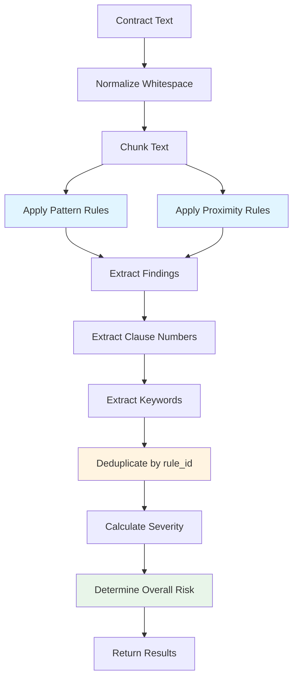
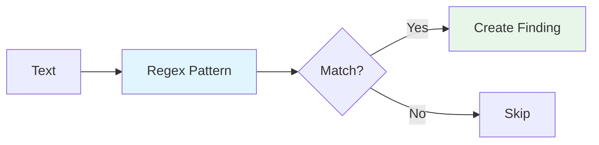
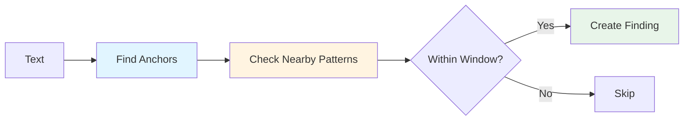
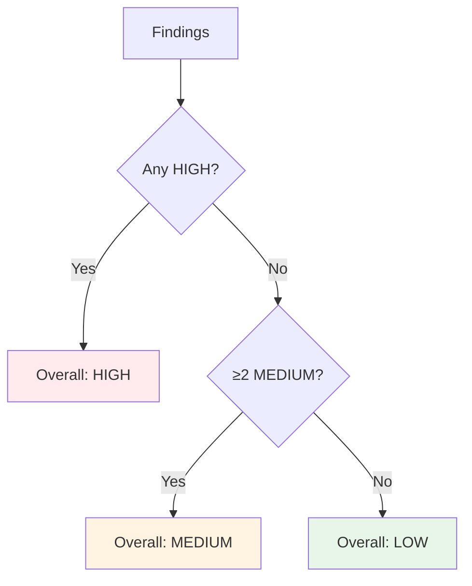

# Rule Engine Flow

## Detection Process

```mermaid
graph TB
    A[Contract Text] --> B[Normalize Whitespace]
    B --> C[Chunk Text]
    C --> D[Apply Pattern Rules]
    C --> E[Apply Proximity Rules]
    D --> F[Extract Findings]
    E --> F
    F --> G[Extract Clause Numbers]
    G --> H[Extract Keywords]
    H --> I[Deduplicate by rule_id]
    I --> J[Calculate Severity]
    J --> K[Determine Overall Risk]
    K --> L[Return Results]
    
    style D fill:#e1f5ff
    style E fill:#e1f5ff
    style I fill:#fff4e1
    style K fill:#e8f5e9
```

## Rule Types

### Pattern-Based Rules

```mermaid
graph LR
    A[Text] --> B[Regex Pattern]
    B --> C{Match?}
    C -->|Yes| D[Create Finding]
    C -->|No| E[Skip]
    
    style B fill:#e1f5ff
    style D fill:#e8f5e9
```

### Proximity-Based Rules

```mermaid
graph LR
    A[Text] --> B[Find Anchors]
    B --> C[Check Nearby Patterns]
    C --> D{Within Window?}
    D -->|Yes| E[Create Finding]
    D -->|No| F[Skip]
    
    style B fill:#e1f5ff
    style C fill:#fff4e1
    style E fill:#e8f5e9
```

## Severity Aggregation

```mermaid
graph TB
    A[Findings] --> B{Any HIGH?}
    B -->|Yes| C[Overall: HIGH]
    B -->|No| D{≥2 MEDIUM?}
    D -->|Yes| E[Overall: MEDIUM]
    D -->|No| F[Overall: LOW]
    
    style C fill:#ffebee
    style E fill:#fff4e1
    style F fill:#e8f5e9
```
