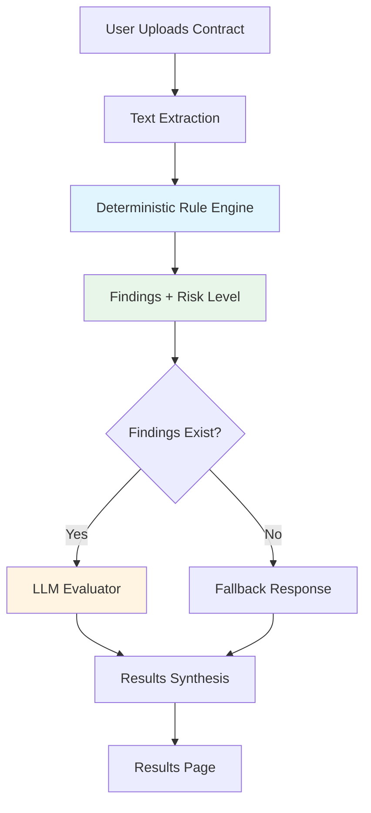
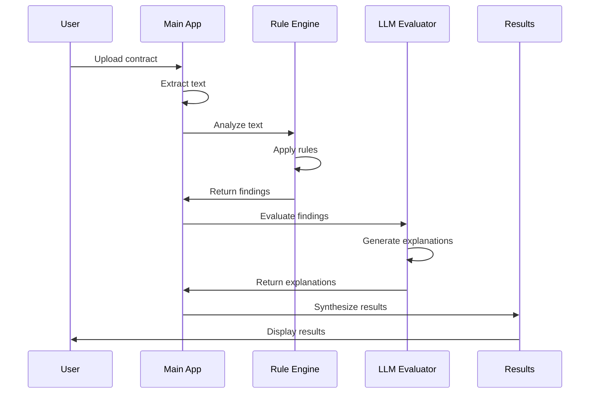
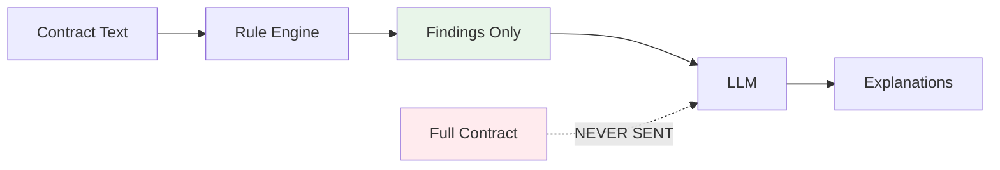

# System Diagram

## High-Level Architecture

## Component Details

### Text Extraction
- PDF: PyPDF2
- DOCX: python-docx
- TXT: UTF-8 decode

### Deterministic Rule Engine
- Pattern-based rules
- Proximity-based rules
- Deduplication
- Severity aggregation

### LLM Evaluator
- Receives findings only
- Generates explanations
- Validates output
- Fallback on failure

## Data Flow

## Boundary Enforcement

